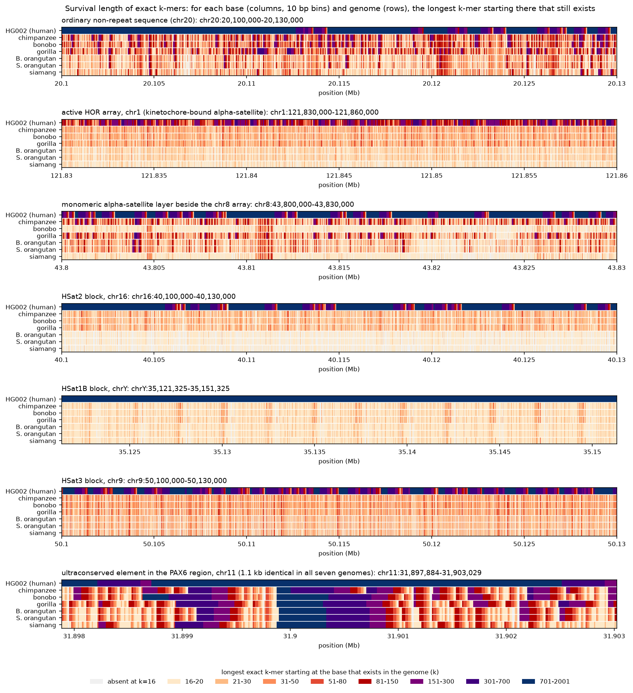
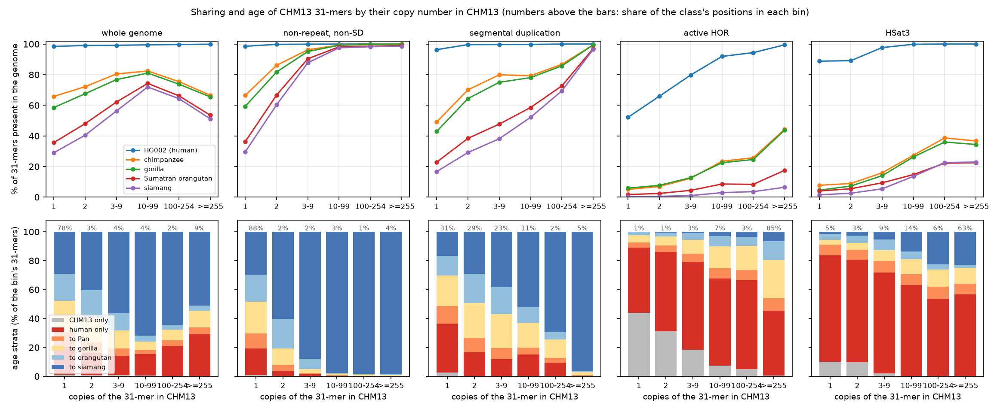
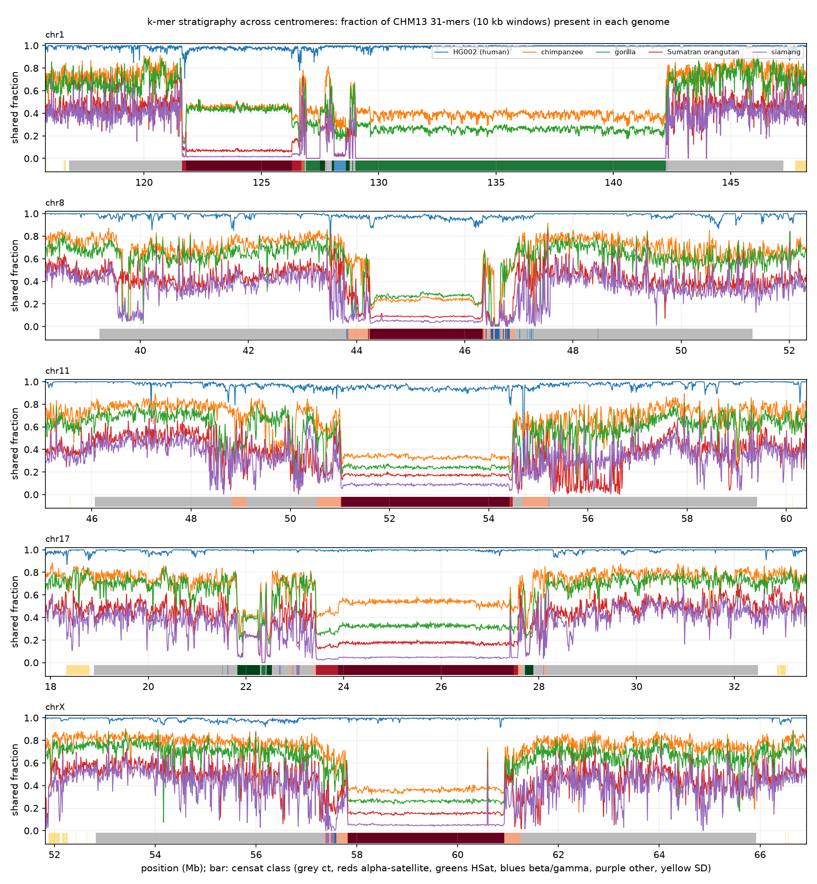

# kstrata: exact k-mer strata of the human genome across the apes

**Interactive site:** https://jlanej.github.io/kstrata/ · **Report (PDF):** [report/kstrata_report.pdf](report/kstrata_report.pdf) · **Tool:** `cargo build --release`

For every base of T2T-CHM13, in which other genomes does the exact k-mer starting there still
exist, and up to what k? `kstrata` answers this against a second human genome (HG002, both
haplotypes) and the six complete ape genomes of 2025, alignment-free and therefore defined
inside the satellite arrays. This README is the full write-up with every table; the PDF report
is the concise version; the site lets you browse the strata along every chromosome.

*Computed on 2026-09-11/12 by Claude Fable 5.1 (Anthropic) for J. Lane. Everything is
regenerable; the large inputs and intermediates are not kept in the repository (see §7).*

## Repository layout

| path | content |
|---|---|
| `src/`, `Cargo.toml` | the `kstrata` tool (Rust): `prep`, `random`, `run` |
| `scripts/` | data fetch, the full pipeline (`run_all.sh`), summaries, figures, tables, site export |
| `tests/bruteforce_check.py` | correctness test against brute-force Python sets |
| `tables/` | raw per-class, per-array, age and segment tables and every run's metadata |
| `fig/` | figures used in this write-up and the report |
| `report/` | the PDF report and its pandoc/XeLaTeX source |
| `tracks/` | the 100 kb genome-wide track |
| `docs/` | the GitHub Pages site (`index.html` + `data/`, produced by `scripts/export_site.py`) |

**Summary.** For every base of T2T-CHM13, `kstrata` records whether the exact k-mer starting
there exists in a second human genome (HG002, both haplotypes) and in each of the six complete
ape genomes of 2025, at k = 31 and along a ladder from 16 to 2,001. The presence bits are sound
(every 31-mer an alignment shows as identical is reported present) and alignment-free, so they
are defined inside the satellite arrays where conservation scores do not exist. Outside repeats,
70% of CHM13's 31-mers exist in chimpanzee, 64% in gorilla, 43% in orangutans and 37% in
siamang; the slope of sharing against k recovers the published divergences (1.17, 1.54 and
2.57% against 1.23, 1.75 and 3.1%) with no alignment. Inside the centromeres the strata are
stark: HSat1B is 92% human-specific at k = 31, HSat2 and HSat1A have no exact 31-mer beyond
the African apes, HSat3 and the rDNA keep 18-28% into siamang, and each active HOR array holds
a flat, array-wide sharing level per ape that steps at its boundaries, with its older flanking
layers more shared. Between species, exact identity over 1 kb survives at 2,186 places with
chimpanzee and 48 with siamang; over 2 kb, at 13 and 4. Dating every 31-mer by its deepest
carrier, 35% of the genome predates the gibbon split, 19% is human-specific and 0.9% is private
to CHM13.

## 0. The question and the choice

The brief was open: what new, useful thing can k-mers give the genomics field? Candidates were
listed, checked against the literature, and pruned. What was rejected, and why:

- **Minimum unique k-mer length per base (the read length needed to anchor a position).** Already
  shipped by the T2T consortium for CHM13 as browser tracks (suffix-array MUL/MUR, 200 bp
  mappability), and generalized in 2026 by the "minimum unique substring" papers.
- **Universal single-copy anchors across the human pangenome.** Done as pan-conserved segment
  tags (Cell Genomics 2023) and PG-SCUnK (BMC Bioinformatics 2025).
- **Alignment-free k-mer identity heat maps of satellites.** StainedGlass and ModDotPlot.
- **k-mer spectra, nullomers, k-mer GWAS, k-mer sample identity, k-mer mutation-rate contexts.**
  Established.

What has not been done, as far as the searches found: the six complete ape genomes published in
2025 (chimpanzee, bonobo, gorilla, two orangutans, siamang) have been compared with the human
genome by alignment, which by construction says nothing inside the satellite arrays that make up
6% of the genome, and the comparison has not been made at the level of exact k-mers at multiple
scales. Exact k-mer presence is alignment-free, base-resolved, and defined in every region of a
complete genome. It answers a question alignment cannot: **for each base of T2T-CHM13, in which
genomes does its exact k-mer still exist, and up to what k?** That is a stratigraphy: the deepest
lineage in which a k-mer survives dates the sequence (with the caveats in §6).

The resource is therefore three things:

1. **`kstrata`**, a small Rust tool (``) that, for every position of a query
   genome, records the presence of its canonical k-mer in up to 8 subject genomes and the
   k-mer's multiplicity in the query, for any k (exact 2-bit keys to k = 32, a 61-bit rolling hash
   above), in bounded memory (partitioned sorting, ~9 GB for a 3 Gb query against 6 Gb subjects).
2. **The strata of T2T-CHM13v2.0** at k = 31, base resolution, against HG002 v1.1 (both
   haplotypes) and the six apes; the same at a ladder of k from 16 to 2001 on a 1/8 systematic
   sample of positions; the strata of one HG002 haplotype against the other and against CHM13.
3. **Derived tables and figures**: sharing by region class (censat v2.1 classes, segmental
   duplications, the rest), the k-mer survival curve against divergence time per class, the
   scale of conservation (sharing against k) per class, the repeat census of CHM13 across scales,
   genome-wide 10 kb and 100 kb tracks, and centromere stratigraphy plots.

## 1. Definitions

A **k-mer stratum** is defined per position of the query genome. For position `p` on the
forward strand of T2T-CHM13v2.0, the k-mer is the sequence `[p, p+k)`; its **canonical form** is
the lexicographically smaller of the k-mer and its reverse complement (`kstrata` compares exact
2-bit encodings for k ≤ 32 and a 61-bit polynomial rolling hash above that; see §3 for the
collision bound). The k-mer is **valid** when it contains no N and does not cross a contig end.

- **Presence** in a subject genome: the canonical k-mer occurs at least once on either strand of
  the subject assembly. This is exact identity, alignment-free, with no notion of homology: a
  k-mer present in chimpanzee may sit at the orthologous locus or anywhere else.
- **Multiplicity** in the query: the number of occurrences of the canonical k-mer in CHM13
  (capped at 255 in the stored array; the full histogram is kept separately).
- **Age** of a k-mer (§4.2): the deepest lineage in which it is present, taking the six apes as
  a ladder (Pan = chimpanzee or bonobo, ~6-7 My; gorilla, ~9 My; Pongo = either orangutan,
  ~15 My; siamang, ~20 My). Absence in a shallower lineage is ignored (loss, incomplete lineage
  sorting, assembly gap); the non-nested patterns are counted separately.
- **Chance sharing**: two unrelated sequences share k-mers by chance at a rate that falls as
  4^-k. A uniform random 3.1 Gb genome is included as a subject on the k ladder to measure it;
  at k = 31 it is nil (2^62 possible canonical 31-mers against 2.5 × 10^9 present).

Region classes follow the CHM13 censat v2.1 annotation (centromere transition `ct`, monomeric
alpha-satellite `mon`, diverged HOR `dhor`, inactive HOR `hor`, active HOR `hor_active` = arrays
whose label ends in `L`, beta `bsat`, gamma `gsat`, HSat1A/1B/2/3, other `censat`, `rDNA`),
painted over the CHM13 segmental-duplication annotation (`SD`); everything else is
"non-repeat, non-SD" (it still contains transposable elements and simple repeats, which are not
masked here).

## 2. Data

| genome | assembly | size (Gb) | role |
|---|---|---|---|
| human, T2T-CHM13v2.0 | chm13v2.0 | 3.117 | query |
| human, HG002 (T2T v1.1, diploid: maternal + paternal) | hg002v1.1 | 6.000 (3.052 + 2.948) | subject; also query for the within-person comparison |
| chimpanzee | GCA_028858775.2 (mPanTro3 v2.0, primary) | 3.178 | subject |
| bonobo | GCA_029289425.2 (mPanPan1 v2.0, primary) | 3.245 | subject |
| gorilla | GCA_029281585.2 (mGorGor1 v2.0, primary) | 3.546 | subject |
| Bornean orangutan | GCA_028885625.2 (mPonPyg2 v2.0, primary) | 3.221 | subject |
| Sumatran orangutan | GCA_028885655.2 (mPonAbe1 v2.0, primary) | 3.260 | subject |
| siamang | GCA_028878055.2 (mSymSyn1 v2.0, primary) | 3.263 | subject |
| uniform random | `kstrata random --seed 1` | 3.100 | chance-sharing control (k ladder only) |

The ape assemblies are the complete ("T2T") genomes of Yoo et al. (Nature 2025), taken as the
primary haploid representation of each diploid assembly; some of their centromeres and rDNA
arrays are not fully resolved (the paper reports 27-85% of centromeres complete depending on
the species), which lowers ape presence inside satellite classes by an unknown amount (§6).

## 3. Method and validation

`kstrata run` scans the query and every subject once per key-space partition. The query's
(key, position) pairs of one partition are sorted; the run lengths give the multiplicity of each
k-mer; each subject's keys of the same partition are sorted and deduplicated and merged against
the query to set one presence bit per subject. Partition count follows from a memory budget, so
a 3.1 Gb query against 6 Gb subjects runs in 9-10 GB of anonymous memory at any k (§4.9). Scanning
is a rolling computation over a memory-mapped byte array of base codes, parallel over 8 Mb
chunks.

**Correctness** was checked against brute-force Python sets of canonical k-mers on synthetic
genomes with planted forward and reverse-complement repeats, an N run, several contigs and a
perfect palindrome, for k = 16, 21, 32 (exact path) and 33, 51, 201 (hash path), with strides 1,
4 and 8 and 1 to 4 partitions: every output byte, the distinct-k-mer count and the multiplicity
histogram agreed in all nine configurations (`tests/bruteforce_check.py`).

**Hash collisions** (k > 32 only): the polynomial hash modulo 2^61 − 1 puts about 1.2 × 10^18
pairs (3.9 × 10^8 sampled query k-mers against 3.1 × 10^9 subject k-mers) into a space of
2.3 × 10^18 values, so about 0.5 false presences are expected per subject per run for
random-like sequence, with the Schwartz-Zippel worst-case bound at a few hundred. The uniform
random control measures it directly: 0 false presences at k = 101, 2 at k = 501 (both ordinary
single-copy sequences on chr20 and chrX), against millions of true presences in every ape at
those k. A collision can only create a false presence, never a false absence, and the k ≤ 32
runs (including the base-resolution k = 31 run) use exact keys with no collisions at all.

**Agreement with alignment** on 5 Mb of chr20 (20-25 Mb) aligned to the chimpanzee assembly by
minimap2 (`asm20 --eqx`):

<!-- validation:prose -->
minimap2 places the 5 Mb in 8 primary alignments. Of the 5,000,000 positions, 3,173,630 (63.5%)
start a 31-mer that lies inside an exact (`=`) run of some alignment; `kstrata` reports every one
of them present in chimpanzee (3,173,630 of 3,173,630). Of the 1,816,311 positions whose primary
alignment carries a mismatch or indel inside the window (and that no other alignment covers
exactly), 13.4% are nonetheless present in chimpanzee, almost all of them multi-copy k-mers in
CHM13; among the 1,582,752 single-copy ones, 1.9% are present, which is the rate at which a
substitution in the orthologous copy is compensated by an identical k-mer elsewhere in the chimp
assembly (or the alignment's difference is not in the chimp genome). Presence over the region is
68.4% by `kstrata` against 63.5% exact by alignment; the difference is what alignment-free
presence measures and alignment does not: the same k-mer existing at another place.
<!-- /validation:prose -->

## 4. Results

### 4.1 Exact 31-mer sharing by region class

Fraction of CHM13 positions (with a valid 31-mer) whose 31-mer is present in each genome.

<!-- table:k31 -->
| region class | Mb | HG002 | chimp | bonobo | gorilla | B. orang | S. orang | siamang | any ape | human-specific | CHM13-only | single-copy in CHM13 |
|---|---|---|---|---|---|---|---|---|---|---|---|---|
| non-repeat, non-SD | 2557.9 | 98.7 | 70.3 | 70.3 | 63.9 | 43.2 | 43.2 | 37.2 | 82.9 | 16.2 | 0.8 | 87.7 |
| segmental duplication | 107.6 | 98.7 | 68.5 | 68.6 | 63.7 | 41.1 | 41.3 | 33.7 | 79.4 | 19.6 | 1.0 | 30.7 |
| centromere transition | 211.3 | 98.8 | 70.8 | 70.6 | 63.9 | 42.4 | 42.4 | 36.0 | 81.8 | 17.3 | 0.8 | 64.1 |
| monomeric alpha-sat | 13.5 | 98.2 | 60.6 | 58.2 | 52.4 | 37.6 | 37.5 | 26.6 | 71.4 | 27.4 | 1.3 | 42.3 |
| diverged HOR | 1.9 | 96.6 | 52.7 | 49.7 | 45.7 | 31.1 | 30.9 | 15.8 | 61.3 | 35.9 | 2.8 | 44.6 |
| inactive HOR | 8.1 | 95.6 | 34.1 | 33.8 | 31.5 | 21.7 | 21.5 | 8.5 | 44.8 | 51.2 | 3.9 | 4.6 |
| active HOR | 62.2 | 97.4 | 40.6 | 37.8 | 40.1 | 16.6 | 15.9 | 5.8 | 50.5 | 47.1 | 2.3 | 1.1 |
| beta satellite | 8.6 | 95.9 | 36.9 | 36.1 | 26.4 | 7.4 | 7.7 | 6.2 | 41.6 | 54.4 | 4.0 | 23.5 |
| gamma satellite | 0.7 | 96.9 | 42.1 | 41.6 | 29.2 | 10.2 | 10.2 | 6.1 | 52.5 | 44.7 | 2.7 | 74.1 |
| HSat1A | 13.4 | 95.8 | 21.4 | 22.7 | 29.8 | 0.0 | 0.0 | 0.0 | 33.8 | 62.2 | 3.9 | 1.9 |
| HSat1B | 15.3 | 99.8 | 5.7 | 4.6 | 5.8 | 1.4 | 1.2 | 2.2 | 7.3 | 92.5 | 0.2 | 1.4 |
| HSat2 | 28.7 | 99.0 | 33.1 | 32.7 | 25.6 | 0.0 | 0.0 | 0.0 | 37.6 | 61.4 | 1.0 | 2.9 |
| HSat3 | 69.3 | 98.9 | 31.4 | 32.2 | 29.2 | 19.1 | 18.8 | 18.3 | 39.2 | 59.8 | 1.0 | 4.9 |
| other censat | 8.9 | 98.4 | 47.5 | 47.0 | 39.5 | 18.8 | 18.5 | 9.8 | 58.4 | 40.3 | 1.3 | 21.0 |
| rDNA | 9.9 | 99.6 | 52.0 | 51.4 | 43.9 | 30.5 | 30.5 | 28.4 | 61.5 | 38.2 | 0.3 | 0.1 |
| **whole genome** | 3117.3 | 98.7 | 67.6 | 67.5 | 61.4 | 40.9 | 40.9 | 34.9 | 79.7 | 19.4 | 0.9 | 77.9 |
<!-- /table -->


<!-- k31:prose -->
Outside the repeats, 70% of CHM13's 31-mers exist in the chimpanzee and bonobo assemblies, 64%
in gorilla, 43% in either orangutan and 37% in siamang, and 98.7% in the other human; segmental
duplications and the centromere-transition class behave like the rest of the genome. The
satellite classes divide into three kinds. Alpha-satellite is shared to a depth that follows its
age structure: monomeric arrays keep 61% of their 31-mers in chimpanzee and 27% in siamang;
diverged HORs 53% and 16%; inactive HORs 34% and 9%; the active, kinetochore-bound arrays 41%
in chimpanzee, 40% in gorilla, 16% in orangutans and 6% in siamang. HSat3 and rDNA keep a
floor of 18-28% into siamang. HSat2 and HSat1A, by contrast, are shared only with the African
apes (33% and 21-30% of 31-mers) and have essentially no exact 31-mer in either orangutan or
siamang (HSat2: 0.01%), and HSat1B is almost entirely human-specific: 92.5% of its 31-mers are
in no ape at all, 5.7% in chimpanzee, while 99.8% are in HG002. Beta and gamma satellite sit
in between (37-42% in chimpanzee, 6-10% beyond gorilla).

Two other columns describe the human side. The CHM13-only fraction, k-mers in no other genome
including HG002, is 0.8% outside repeats and rises to 3-4% in the HOR arrays, HSat1A and beta
satellite; it bounds the sum of CHM13-private variation and assembly error at k = 31. The
single-copy column is the fraction of positions whose 31-mer occurs once in CHM13: 88% outside
repeats, 31% in segmental duplications, and 1-5% in the active HORs, HSat1B, HSat2 and HSat3
(0.1% in the rDNA models), which is why those classes need read-scale anchors rather than
k-mers.
<!-- /k31:prose -->

### 4.2 Age strata

Each CHM13 31-mer is dated by the deepest lineage that carries it (so "to Pan" is present in
chimpanzee or bonobo and in no more distant ape). The last three columns count non-nested
patterns: present in gorilla but in neither Pan genome (and in no more distant ape), and the
chimpanzee/bonobo asymmetry.

<!-- table:ages -->
| region class | Mb | CHM13 only | human only (in HG002) | to Pan (>=6 My) | to gorilla (>=9 My) | to orangutan (>=15 My) | to siamang (>=20 My) | gorilla not Pan | chimp not bonobo | bonobo not chimp |
|---|---|---|---|---|---|---|---|---|---|---|
| non-repeat, non-SD | 2557.9 | 0.8 | 16.2 | 9.1 | 19.6 | 17.1 | 37.2 | 3.1 | 3.6 | 3.6 |
| segmental duplication | 107.6 | 1.0 | 19.6 | 8.9 | 21.1 | 15.6 | 33.7 | 3.6 | 2.9 | 3.0 |
| centromere transition | 211.3 | 0.8 | 17.3 | 9.7 | 20.1 | 16.0 | 36.0 | 3.1 | 3.4 | 3.2 |
| monomeric alpha-sat | 13.5 | 1.3 | 27.4 | 13.2 | 17.3 | 14.2 | 26.6 | 4.3 | 5.4 | 3.1 |
| diverged HOR | 1.9 | 2.8 | 35.9 | 11.5 | 16.7 | 17.3 | 15.8 | 3.6 | 5.4 | 2.5 |
| inactive HOR | 8.1 | 3.9 | 51.2 | 8.5 | 12.8 | 15.1 | 8.5 | 3.9 | 3.6 | 3.3 |
| active HOR | 62.2 | 2.3 | 47.1 | 8.1 | 24.4 | 12.2 | 5.8 | 5.6 | 5.4 | 2.6 |
| beta satellite | 8.6 | 4.0 | 54.4 | 12.9 | 18.3 | 4.1 | 6.2 | 1.7 | 2.6 | 1.8 |
| gamma satellite | 0.7 | 2.7 | 44.7 | 19.0 | 20.4 | 7.1 | 6.1 | 4.6 | 4.5 | 4.0 |
| HSat1A | 13.4 | 3.9 | 62.2 | 4.0 | 29.8 | 0.0 | 0.0 | 8.2 | 3.0 | 4.3 |
| HSat1B | 15.3 | 0.2 | 92.5 | 1.0 | 3.5 | 0.6 | 2.2 | 1.0 | 1.1 | 0.1 |
| HSat2 | 28.7 | 1.0 | 61.4 | 12.0 | 25.5 | 0.0 | 0.0 | 2.0 | 2.9 | 2.5 |
| HSat3 | 69.3 | 1.0 | 59.8 | 7.4 | 10.1 | 3.3 | 18.3 | 2.3 | 3.0 | 3.8 |
| other censat | 8.9 | 1.3 | 40.3 | 14.3 | 22.6 | 11.7 | 9.8 | 4.8 | 3.1 | 2.6 |
| rDNA | 9.9 | 0.3 | 38.2 | 12.1 | 13.7 | 7.4 | 28.4 | 3.5 | 3.0 | 2.4 |
| **whole genome** | 3117.3 | 0.9 | 19.4 | 9.1 | 19.5 | 16.2 | 34.9 | 3.2 | 3.6 | 3.5 |
<!-- /table -->

<!-- ages:prose -->
Dating by the deepest carrier, 35% of the genome's 31-mers predate the split from gibbons, a
further 16% are shared out to orangutans, 20% to gorilla and 9% to chimpanzee and bonobo only;
19% are human-specific (in HG002 but in no ape) and 0.9% are private to CHM13. The
human-specific fraction is 16% in non-repeat sequence and 47-92% in the active HOR arrays,
HSat1A, HSat1B and HSat2: sequence that arose or was homogenized to its present state after the
human lineage separated. The non-nested patterns have the size expected from the branch lengths
rather than from any single cause: in non-repeat sequence, k-mers present in a Pan genome but
not gorilla (9.1%) outnumber those present in gorilla but in neither Pan (3.1%) by 2.9 to 1,
the ratio of the branch on which a gorilla-absent k-mer can be lost (the gorilla lineage plus
the human-Pan stem, about 12 My) to the branch on which a Pan-absent one can be lost (the Pan
stem before the chimpanzee-bonobo split, about 4-5 My), with incomplete lineage sorting adding
to the second class; chimpanzee-not-bonobo and bonobo-not-chimpanzee are equal (3.6% each), as
they should be for two branches of the same length. Among 31-mers present in chimpanzee, 5.1%
are absent from bonobo, which corresponds to a per-base rate of about 0.17% on the bonobo
branch, in line with the ~0.4% total divergence between the two species.

Inside the centromeres the pattern is the layered one: HSat1A keeps 30% of its 31-mers in
gorilla but 21-23% in chimpanzee and bonobo, the only class in which gorilla is the closest ape,
and the gorilla-not-Pan excess (8.2% against 4.0%) says that the human HSat1A repertoire is
closer to the gorilla's than to the Pan one, whether by lineage sorting of satellite variants or
by turnover in Pan.
<!-- /ages:prose -->

### 4.3 The scale of conservation: sharing as a function of k

Fraction of CHM13 k-mers (1/8 systematic sample of positions; k = 31 at full resolution, from a
run without the random subject) present in the named genome.

<!-- table:ladder -->
| class, genome | k=16 | k=21 | k=31 | k=41 | k=61 | k=101 | k=201 | k=501 | k=1001 | k=2001 |
|---|---|---|---|---|---|---|---|---|---|---|
| non-repeat, non-SD, chimp | 96.8 | 80.9 | 70.3 | 61.3 | 46.9 | 28.6 | 9.4 | 0.5 | 0.0 | 0.0 |
| non-repeat, non-SD, siamang | 92.5 | 54.6 | 37.2 | 25.6 | 12.2 | 3.3 | 0.3 | 0.0 | 0.0 | 0.0 |
| non-repeat, non-SD, random | 76.2 | 0.1 | -- | 0.0 | 0.0 | 0.0 | 0.0 | 0.0 | 0.0 | 0.0 |
| segmental duplication, chimp | 96.1 | 80.1 | 68.5 | 58.8 | 43.6 | 25.2 | 7.4 | 0.3 | 0.0 | 0.0 |
| active HOR, chimp | 94.6 | 69.6 | 40.6 | 20.6 | 4.2 | 0.2 | 0.0 | 0.0 | 0.0 | 0.0 |
| active HOR, siamang | 84.9 | 28.7 | 5.8 | 0.9 | 0.0 | 0.0 | 0.0 | 0.0 | 0.0 | 0.0 |
| inactive HOR, chimp | 93.9 | 64.9 | 34.1 | 16.4 | 4.0 | 0.4 | 0.0 | 0.0 | 0.0 | 0.0 |
| monomeric alpha-sat, chimp | 97.8 | 81.5 | 60.6 | 44.5 | 26.1 | 10.9 | 1.5 | 0.0 | 0.0 | 0.0 |
| HSat3, chimp | 93.3 | 65.1 | 31.4 | 14.1 | 2.0 | 0.0 | 0.0 | 0.0 | 0.0 | 0.0 |
| HSat3, siamang | 84.0 | 44.7 | 18.3 | 7.5 | 1.1 | 0.0 | 0.0 | 0.0 | 0.0 | 0.0 |
| HSat2, chimp | 92.8 | 65.9 | 33.1 | 13.4 | 1.7 | 0.1 | 0.0 | 0.0 | 0.0 | 0.0 |
| HSat1B, chimp | 93.6 | 30.8 | 5.7 | 2.5 | 0.1 | 0.0 | 0.0 | 0.0 | 0.0 | 0.0 |
| beta satellite, chimp | 89.6 | 57.9 | 36.9 | 24.0 | 11.6 | 4.3 | 1.0 | 0.0 | 0.0 | 0.0 |
| other censat, chimp | 92.1 | 63.5 | 47.5 | 37.0 | 23.8 | 11.1 | 2.0 | 0.1 | 0.0 | 0.0 |
<!-- /table -->


<!-- ladder:prose -->
The random control fixes the scale at which sharing means descent: a uniform random 3.1 Gb
genome contains 76% of all 16-mers (the expected 1 − e^(−3.1/2.15)), 0.1-0.3% of 21-mers and
none of any longer k-mer, so k = 16 is chance-dominated in every class and everything from k = 21
up is identity by descent (or by convergent homogenization, in satellites).

Outside the repeats the curves are the survival curves of §4.4: geometric in k, with the slope
set by divergence. The satellite classes fall away faster, and differently. The active HOR
arrays keep 41% of their 31-mers in chimpanzee but 4% of 61-mers and 0.2% of 101-mers, an
effective per-base difference of about 7% between a human HOR copy and its nearest chimpanzee
copy; against orangutan the array k-mers are gone by k = 61 and against siamang by k = 41,
while the same class shares 85-95% of its 16-mers with every ape, i.e. the monomer vocabulary
is old and the higher-order arrangement is not. HSat2 loses its chimpanzee 31-mers by k = 101
(33% at 31, 1.7% at 61) and has no orangutan or siamang k-mer beyond k = 21; HSat1B has none
beyond k = 41 in any ape. HSat3 is the exception that proves the mechanism: its 31-mers are
shared to the same degree with siamang (18%) as the active HOR's are with chimpanzee, and its
curves for chimpanzee and siamang have the same slope (2.0% and 1.1% at k = 61), because what
is shared is the near-perfect (GGAAT)n runs that every ape carries, not descent from a common
array. Beta satellite and the rDNA models retain a conserved core: 4% and 14% of 101-mers in
chimpanzee, 10% of rDNA 101-mers in siamang, and at k = 1001 the rDNA contributes 222 of
chimpanzee's identical segments (the 45S transcription unit).

At long k the strata become discrete objects. The number of exactly identical stretches of at
least 501 bp, from runs of sampled positions: 125,475 with chimpanzee, 32,673 with gorilla,
about 2,100 with each orangutan and 2,278 with siamang (1,104 of them in the rDNA). At 1,001 bp:
2,186 with chimpanzee (1,794 outside repeats, 222 rDNA, 109 centromere transition, 57 SD), 568
with gorilla, 56-58 with the orangutans and 48 with siamang (22 non-repeat, 20 SD, 4 other
censat). Reading the 48 siamang segments from the sequence sorts them into two kinds: 28 are telomeric
(TTAGGG)n tracts within a few kilobases of a chromosome end (the repeat is perfect and identical
in every ape, which is also what the 20 "segmental duplication" segments of the class count are),
and 20 are stretches of single-copy sequence of 1.0 to 1.5 kb, the ultraconserved elements
(several at classic loci: the PAX6 region of chr11 at 31.90 Mb, chr2 at 60.47 Mb near BCL11A,
chr19 at 32.87 Mb, chr1 at 213.24 Mb). At 2,001 bp the count is 13 with chimpanzee, 11 with
bonobo, 5 with gorilla, 6 with each orangutan and 4 with siamang, and all four siamang segments
are telomeric tracts; HG002 still shares 323,668 such segments with CHM13, so 2 kb of exact
identity is common within a species and, outside the telomeres, absent between species. The
per-segment list with its classification is `tables/ucs_k1001_siamang.json`.
<!-- /ladder:prose -->

### 4.3b Survival length per base: the question, drawn

The two questions of §0, *in which genomes* and *up to what k*, are answered together by one
number per base and genome: the longest exact k-mer starting at that base that still exists in
that genome. It was computed on the k ladder (17 values from 16 to 2,001) for the 64 spotlight
regions of the site (6.9 Mb; `scripts/run_survival_ladder.sh`, `scripts/survival.py`; each k
takes about a minute because the query is small and every subject is scanned once against a
hash set of the query's k-mers), and it is the colour of the per-base rows in the site's
spotlight views. The figure shows seven regions.



In ordinary sequence (chr20) the median survival is 51 bases in chimpanzee, bonobo and gorilla,
25 in the orangutans and 21 in siamang, against 1,501 or more in the other human: the expected
spacing of differences at 1.2, 3 and 4% divergence and at 0.1% heterozygosity. Inside the chr1
active HOR array the median falls to 25 in the African apes and to 16, the shortest k tested,
in orangutans and siamang, and the strips are uniformly pale: no copy in any ape matches a human
copy for more than a few dozen bases. The monomeric layer beside the chr8 array is patchier and
older, with runs of 50-300 bases in gorilla and both orangutans. HSat2 (chr16) survives to 21
bases in the African apes and to 16 in the others; HSat1B (chrY) to 16 in every ape, its
31-mers gone, while the other human carries every 2 kb of it. HSat3 (chr9) shows the same
short survival in all six apes, the (GGAAT)n vocabulary and nothing longer. The PAX6-region
element is the opposite: 1.1 kb over which every genome matches for 700 bases or more, flanked
by sequence that decays to the ordinary 20-100 within a kilobase on either side. The colour
scale is the same in every panel; what changes between regions is the scale at which the
genomes still agree.

### 4.4 Apparent divergence from k-mer survival

In sequence without repeats, an exact k-mer survives between two genomes when none of its k
bases has changed, so the shared fraction is close to (1 − d)^k for a per-base divergence d
(substitutions and indels together, on both lineages). Two alignment-free estimates of d from
the non-repeat class, against published alignment-based single-nucleotide divergences:

<!-- table:divergence -->
| genome | 31-mers shared, non-repeat (%) | d from k=31 alone (%) | d from the slope of ln f over k=31..201 (%) | published single-nucleotide divergence (%) |
|---|---|---|---|---|
| HG002 | 98.73 | 0.041 | 0.050 | ~0.1 (heterozygosity) |
| chimp | 70.31 | 1.130 | 1.172 | 1.23 (CSAC 2005) |
| bonobo | 70.27 | 1.132 | 1.174 | 1.3 (Pruefer 2012) |
| gorilla | 63.86 | 1.436 | 1.538 | 1.75 (Scally 2012) |
| B. orang | 43.22 | 2.670 | 2.575 | 3.1 (Locke 2011) |
| S. orang | 43.25 | 2.668 | 2.572 | 3.1 (Locke 2011) |
| siamang | 37.20 | 3.140 | 2.877 | not tabulated here |
<!-- /table -->


<!-- divergence:prose -->
The slope of ln(shared fraction) against k in non-repeat sequence recovers the alignment-based
divergences without an alignment: 1.17% for chimpanzee and bonobo, 1.54% for gorilla, 2.57% for
the orangutans, against 1.23, 1.75 and 3.1% from the genome papers. The estimates are lower than
the alignment values, and lower still when the fit extends to longer k (chimpanzee: 1.28% over
k = 31-101, 1.17% over 31-201), for a reason built into k-mer survival: the shared fraction is an
average of (1 − d_local)^k over regions whose local divergence varies, and long k-mers survive
preferentially in the least diverged regions, so the effective rate is pulled towards the
conserved end of the distribution (Jensen's inequality; Mash distances carry the same bias). The
single-point estimate from k = 31 alone, 1 − f^(1/31), is lower again because at k = 31 a k-mer
lost at the orthologous locus is sometimes found elsewhere (§3). Read the column as an
alignment-free lower bound on mean divergence that ranks the genomes correctly and lands within
0.1-0.5 points of the published values. Siamang comes out at 2.9-3.1%, only slightly above the
orangutans, which is the same compression at the conserved end; the HG002 row (0.04-0.05%) is
the survival against a diploid genome, in which either haplotype can carry the k-mer, and is
about half the per-haplotype figure of §4.5.
<!-- /divergence:prose -->

### 4.5 Within one person: the two haplotypes of HG002

The same measurement inside a diploid genome: 31-mers of the maternal haplotype (autosomes
only, since chrX has no counterpart on the Y-bearing paternal haplotype) looked up in the paternal
haplotype and in CHM13.

<!-- table:within -->
| region class (HG002 maternal autosomes) | Mb | in paternal haplotype | in CHM13 | in either | single-copy in maternal |
|---|---|---|---|---|---|
| non-repeat, non-SD | 2627.3 | 97.5 | 97.5 | 98.7 | 85.7 |
| centromere transition | 79.7 | 97.0 | 97.9 | 98.8 | 34.7 |
| monomeric alpha-sat | 12.9 | 97.3 | 96.7 | 98.4 | 40.3 |
| diverged HOR | 1.7 | 97.2 | 94.7 | 98.6 | 47.1 |
| inactive HOR | 7.9 | 93.5 | 93.4 | 96.4 | 5.1 |
| active HOR | 58.4 | 97.5 | 95.5 | 98.6 | 1.1 |
| beta satellite | 5.8 | 95.7 | 96.3 | 97.7 | 22.7 |
| gamma satellite | 0.7 | 96.2 | 95.0 | 98.0 | 64.8 |
| HSat1A | 11.3 | 91.3 | 95.3 | 96.9 | 2.2 |
| HSat1B | 1.4 | 86.9 | 95.2 | 97.0 | 5.7 |
| HSat2 | 18.0 | 96.7 | 98.1 | 98.9 | 4.5 |
| HSat3 | 40.9 | 94.9 | 96.7 | 97.7 | 6.8 |
| other censat | 6.7 | 95.2 | 95.5 | 97.1 | 26.3 |
| rDNA | 1.1 | 98.8 | 98.5 | 99.1 | 2.9 |
| **whole genome** | 2873.8 | 97.4 | 97.5 | 98.7 | 79.8 |
<!-- /table -->

<!-- within:prose -->
On the autosomes, 97.4% of the maternal haplotype's 31-mers exist in the paternal haplotype and
97.5% in CHM13, the same number to a tenth of a percent: at k = 31 the two haplotypes of one
person are as far from each other as either is from a third person, as expected for two
independent samples from the population, and the 2.5% loss corresponds to a per-base
difference of about 0.08% ((1 − d)^31 = 0.975). The ordering flips inside the centromeres:
active HOR 31-mers of the maternal haplotype are found in the paternal haplotype 97.5% of the
time but in CHM13 95.5%, and HSat1B 86.9% against 95.2%, so a centromere haplotype can be
closer to CHM13's than to the other haplotype in the same nucleus, the array-level haplotype
diversity that the 2024-2026 centromere surveys describe. Only 1.1% of active-HOR 31-mers and
2-7% of HSat1-3 31-mers are single-copy within one haplotype, against 86% outside the repeats.
(chrX is excluded: the paternal haplotype carries a Y, and only 17.8% of maternal chrX 31-mers
are found on it, against 98.7% in CHM13's X.)
<!-- /within:prose -->

### 4.6 Repeat census of CHM13 across scales

Fraction of genome positions whose k-mer occurs the given number of times in CHM13 (both
strands), from the same runs. This is the copy-number spectrum of the assembled genome as a
function of scale, without annotation.

<!-- table:census -->
| k | distinct k-mers (G) | 1 (single copy) | 2 | 3-9 | 10-99 | 100-999 | >=1000 |
|---|---|---|---|---|---|---|---|
| 16 | 0.800 | 11.1 | 10.7 | 36.3 | 20.7 | 6.9 | 14.4 |
| 21 | 2.261 | 68.9 | 4.3 | 5.3 | 5.8 | 5.0 | 10.7 |
| 31 | 2.512 | 77.9 | 3.1 | 4.3 | 4.4 | 3.7 | 6.6 |
| 41 | 2.645 | 82.4 | 2.8 | 3.7 | 3.5 | 2.9 | 4.6 |
| 61 | 2.780 | 87.1 | 2.4 | 2.9 | 2.4 | 2.3 | 2.9 |
| 101 | 2.861 | 90.1 | 2.1 | 2.4 | 1.8 | 2.1 | 1.6 |
| 201 | 2.923 | 92.1 | 2.1 | 2.1 | 1.6 | 1.6 | 0.5 |
| 501 | 2.985 | 94.2 | 2.2 | 1.8 | 1.2 | 0.6 | 0.0 |
| 1001 | 3.027 | 95.7 | 2.0 | 1.4 | 0.7 | 0.1 | 0.0 |
| 2001 | 3.063 | 97.2 | 1.7 | 0.7 | 0.4 | 0.0 | 0.0 |
<!-- /table -->


<!-- census:prose -->
The genome resolves with k in three steps. At k = 16 only 11% of positions carry a single-copy
k-mer, and 14% carry one present a thousand times or more, because 4^16 is about the genome
size and most 16-mers recur by chance. At k = 21 the chance component is gone (0.8 to 2.26
billion distinct k-mers between k = 16 and 21) and 69% of positions are single-copy; k = 31
adds nine points (78%) and k = 101 twelve more (90%). Beyond that the gain is slow, 92% at
k = 201, 94% at 501, 96% at 1,001 and 97% at 2,001, and the remaining 3% of the genome, the
positions whose 2 kb context still occurs at least twice, are the satellite arrays, the rDNA
and the youngest segmental duplications. The high-copy bins collapse first: k-mers present
≥1,000 times fall from 6.6% of positions at k = 31 to 0.5% at k = 201 and nil at k = 501, and
the 100-999 bin follows by k = 1,001, while the two-copy bin (recent duplications and the
diploid-like structure of some arrays) is the most persistent, still 1.7% at k = 2,001.
<!-- /census:prose -->

### 4.6b Sharing by copy number: two clocks

The multiplicity of a k-mer in CHM13 changes what its presence in another genome means. A
single-copy 31-mer found in chimpanzee is evidence about one locus; a 31-mer with a thousand
copies found in chimpanzee says that the repeat family is older than the split, whatever
happened at any one locus. The table gives, for each class and copy-number bin, the share of
the class's positions in the bin, the fraction present in each genome, and three of the age
strata (`tables/chm13_k31_by_multiplicity.json`; `scripts/by_multiplicity.py`).

| region class | copies in CHM13 | share of class (%) | HG002 | chimp | gorilla | S. orang | siamang | CHM13 only | human only | to siamang |
|:---|:---|---:|---:|---:|---:|---:|---:|---:|---:|---:|
| whole genome | 1 | 77.9 | 98.4 | 65.8 | 58.5 | 35.6 | 29.0 | 1.1 | 19.0 | 29.0 |
| whole genome | 2 | 3.1 | 99.1 | 72.2 | 67.5 | 48.0 | 40.4 | 0.8 | 15.2 | 40.4 |
| whole genome | 3-9 | 4.3 | 99.2 | 80.5 | 76.8 | 62.1 | 56.3 | 0.7 | 13.4 | 56.3 |
| whole genome | 10-99 | 4.4 | 99.5 | 82.4 | 81.0 | 74.3 | 71.9 | 0.5 | 14.8 | 71.9 |
| whole genome | 100-254 | 1.7 | 99.7 | 75.4 | 73.8 | 66.2 | 64.3 | 0.3 | 20.7 | 64.3 |
| whole genome | >=255 | 8.6 | 99.9 | 66.5 | 65.5 | 53.5 | 51.1 | 0.1 | 29.2 | 51.1 |
| non-repeat, non-SD | 1 | 87.7 | 98.6 | 66.5 | 59.3 | 36.2 | 29.6 | 1.0 | 18.4 | 29.6 |
| non-repeat, non-SD | 2 | 1.6 | 99.8 | 86.1 | 81.8 | 66.6 | 60.3 | 0.1 | 3.8 | 60.3 |
| non-repeat, non-SD | 3-9 | 2.3 | 99.9 | 96.3 | 95.1 | 90.4 | 87.8 | 0.1 | 1.4 | 87.8 |
| non-repeat, non-SD | 10-99 | 3.1 | 100.0 | 99.3 | 99.2 | 98.2 | 97.6 | 0.0 | 0.5 | 97.6 |
| non-repeat, non-SD | 100-254 | 1.1 | 100.0 | 99.8 | 99.8 | 98.6 | 98.2 | 0.0 | 0.1 | 98.2 |
| non-repeat, non-SD | >=255 | 4.2 | 100.0 | 100.0 | 100.0 | 99.0 | 98.6 | 0.0 | 0.0 | 98.6 |
| segmental duplication | 1 | 30.6 | 96.3 | 49.1 | 42.9 | 22.8 | 16.7 | 2.7 | 33.9 | 16.7 |
| segmental duplication | 2 | 29.2 | 99.6 | 70.1 | 64.4 | 38.4 | 29.1 | 0.3 | 16.3 | 29.1 |
| segmental duplication | 3-9 | 22.9 | 99.7 | 79.9 | 75.0 | 47.7 | 38.1 | 0.2 | 11.7 | 38.1 |
| segmental duplication | 10-99 | 10.8 | 99.7 | 79.3 | 78.1 | 58.5 | 52.1 | 0.2 | 15.0 | 52.1 |
| segmental duplication | 100-254 | 1.8 | 100.0 | 86.7 | 85.7 | 72.7 | 69.4 | 0.0 | 9.6 | 69.4 |
| segmental duplication | >=255 | 4.6 | 100.0 | 99.4 | 99.4 | 97.0 | 96.5 | 0.0 | 0.5 | 96.5 |
| monomeric alpha-satellite | 1 | 42.3 | 95.8 | 39.4 | 27.0 | 8.8 | 3.1 | 3.0 | 42.8 | 3.1 |
| monomeric alpha-satellite | 2 | 12.1 | 99.9 | 51.2 | 41.5 | 20.3 | 8.0 | 0.1 | 34.0 | 8.0 |
| monomeric alpha-satellite | 3-9 | 20.3 | 100.0 | 63.8 | 56.4 | 38.4 | 19.7 | 0.0 | 24.1 | 19.7 |
| monomeric alpha-satellite | 10-99 | 13.9 | 100.0 | 96.1 | 94.4 | 88.2 | 69.0 | 0.0 | 1.9 | 69.0 |
| monomeric alpha-satellite | 100-254 | 2.5 | 100.0 | 99.4 | 99.2 | 97.7 | 88.1 | 0.0 | 0.2 | 88.1 |
| monomeric alpha-satellite | >=255 | 8.9 | 100.0 | 99.9 | 99.9 | 99.3 | 95.9 | 0.0 | 0.0 | 95.9 |
| active HOR | 1 | 1.1 | 52.2 | 5.0 | 5.9 | 1.7 | 0.4 | 43.8 | 45.1 | 0.4 |
| active HOR | 2 | 0.9 | 65.9 | 6.9 | 7.7 | 2.4 | 0.5 | 31.0 | 54.9 | 0.5 |
| active HOR | 3-9 | 3.0 | 79.8 | 12.3 | 12.7 | 4.4 | 1.0 | 18.4 | 60.7 | 1.0 |
| active HOR | 10-99 | 6.8 | 91.9 | 23.4 | 22.5 | 8.6 | 2.9 | 7.3 | 60.4 | 2.9 |
| active HOR | 100-254 | 3.0 | 94.4 | 25.7 | 24.6 | 8.4 | 3.6 | 4.9 | 61.7 | 3.6 |
| active HOR | >=255 | 85.3 | 99.5 | 44.3 | 43.8 | 17.5 | 6.4 | 0.4 | 45.0 | 6.4 |
| HSat2 | 1 | 2.9 | 82.8 | 8.2 | 5.4 | 0.0 | 0.0 | 16.7 | 70.6 | 0.0 |
| HSat2 | 2 | 1.5 | 88.8 | 12.5 | 9.9 | 0.1 | 0.0 | 10.9 | 70.1 | 0.0 |
| HSat2 | 3-9 | 3.5 | 91.9 | 18.8 | 15.7 | 0.1 | 0.0 | 7.9 | 68.3 | 0.0 |
| HSat2 | 10-99 | 10.0 | 99.2 | 15.5 | 13.3 | 0.1 | 0.0 | 0.8 | 80.1 | 0.0 |
| HSat2 | 100-254 | 5.0 | 100.0 | 20.4 | 17.6 | 0.0 | 0.0 | 0.0 | 74.9 | 0.0 |
| HSat2 | >=255 | 77.1 | 100.0 | 38.2 | 29.2 | 0.0 | 0.0 | 0.0 | 57.3 | 0.0 |
| HSat3 | 1 | 4.9 | 88.8 | 7.7 | 4.5 | 4.0 | 1.5 | 10.0 | 73.8 | 1.5 |
| HSat3 | 2 | 3.2 | 89.1 | 8.9 | 7.2 | 5.5 | 2.6 | 9.7 | 71.0 | 2.6 |
| HSat3 | 3-9 | 8.6 | 97.7 | 15.9 | 14.0 | 9.3 | 5.4 | 2.0 | 69.7 | 5.4 |
| HSat3 | 10-99 | 14.5 | 99.9 | 27.4 | 26.3 | 14.7 | 13.6 | 0.1 | 63.0 | 13.6 |
| HSat3 | 100-254 | 5.7 | 100.0 | 38.7 | 36.0 | 22.2 | 22.6 | 0.0 | 53.6 | 22.6 |
| HSat3 | >=255 | 63.2 | 100.0 | 36.7 | 34.4 | 22.5 | 22.9 | 0.0 | 56.7 | 22.9 |



Outside the repeats the two clocks run apart: single-copy 31-mers (88% of the class) exist in
chimpanzee 66% of the time and in siamang 30%, the survival expected from divergence, whereas
31-mers with ten or more copies exist in every ape 98 to 100% of the time and 98% of them fall
in the deepest stratum. Those are the transposable-element and simple-repeat words that every
ape genome carries; they are 8% of non-repeat positions, and they inflate the class's sharing
with siamang from 30% to 37%. In segmental duplications the single-copy 31-mers, which are the
paralogue-distinguishing variants, are shared *less* than ordinary sequence (49% in chimpanzee,
17% in siamang, 34% human-only) while the high-copy ones behave like the transposons. Inside the
active HOR arrays 85% of positions carry a 31-mer with 255 or more copies, and those are the
ones shared with the apes (44% in chimpanzee, 6% in siamang); the 1.1% of positions with a
single-copy 31-mer are 44% private to CHM13 and 45% human-only, and only 5% exist in chimpanzee.
HSat3 shows the same split (single-copy: 74% human-only, 10% CHM13-only; 255+ copies: 37% in
chimpanzee, 23% in siamang). The rare k-mers that make one copy of an array different from the
others are, then, mostly variants private to one person, which is what makes them usable for
genotyping centromeres and useless for dating them.

For reading the strata this means: the default tracks (all k-mers) measure the age of the
sequence vocabulary, single-copy tracks measure the conservation of the locus, and the two
should be read side by side. The site's browser has a switch for it, and every window file
carries both sets of counts.

### 4.7 Stratigraphy of centromeres



Per array, exactly (every active HOR array of CHM13; intervals within 500 kb merged):

<!-- table:arrays -->
| active HOR array | Mb | single-copy 31-mers (%) | HG002 | chimp | bonobo | gorilla | B. orang | S. orang | siamang | highest ape |
|---|---|---|---|---|---|---|---|---|---|---|
| chr1:121.80-126.30 | 4.50 | 0.9 | 97.4 | 45.6 | 41.4 | 44.0 | 8.1 | 6.9 | 1.6 | chimp |
| chr2:92.32-94.67 | 2.36 | 1.7 | 96.7 | 45.6 | 43.4 | 43.1 | 24.2 | 23.7 | 10.4 | chimp |
| chr3:91.74-92.90 | 0.89 | 1.1 | 99.6 | 41.6 | 35.6 | 40.7 | 12.7 | 11.3 | 3.7 | chimp |
| chr3:95.86-96.42 | 0.55 | 2.1 | 97.1 | 41.1 | 36.0 | 40.3 | 13.0 | 11.7 | 3.6 | chimp |
| chr4:49.71-50.43 | 0.73 | 0.9 | 95.4 | 38.6 | 35.6 | 45.4 | 24.0 | 23.2 | 9.3 | gorilla |
| chr4:52.12-55.20 | 2.97 | 0.9 | 94.3 | 38.7 | 35.6 | 45.9 | 24.1 | 23.3 | 9.6 | gorilla |
| chr5:47.04-49.60 | 2.53 | 0.8 | 96.2 | 47.7 | 41.4 | 48.7 | 11.5 | 11.3 | 3.8 | gorilla |
| chr6:58.29-61.06 | 2.77 | 0.4 | 89.5 | 29.2 | 25.6 | 22.8 | 14.9 | 15.3 | 4.5 | chimp |
| chr7:60.41-63.71 | 3.30 | 0.8 | 99.8 | 50.5 | 40.7 | 49.5 | 14.4 | 14.2 | 3.4 | chimp |
| chr8:44.22-46.33 | 2.08 | 1.2 | 95.8 | 23.2 | 23.2 | 26.5 | 9.3 | 8.7 | 4.7 | gorilla |
| chr9:44.95-47.58 | 2.63 | 1.6 | 99.0 | 47.0 | 47.0 | 52.2 | 31.3 | 29.4 | 12.7 | gorilla |
| chr10:39.63-41.66 | 2.03 | 1.6 | 95.9 | 44.0 | 40.9 | 44.4 | 11.2 | 10.8 | 2.9 | gorilla |
| chr11:51.04-54.41 | 3.38 | 1.0 | 94.3 | 33.2 | 29.9 | 24.1 | 18.0 | 17.2 | 8.7 | chimp |
| chr12:34.62-37.20 | 2.58 | 1.6 | 94.2 | 37.6 | 33.8 | 41.9 | 12.4 | 12.7 | 1.8 | gorilla |
| chr13:15.55-17.50 | 1.95 | 0.3 | 99.7 | 27.2 | 27.0 | 44.2 | 14.4 | 13.2 | 5.4 | gorilla |
| chr14:10.09-12.71 | 2.62 | 0.4 | 98.1 | 39.4 | 39.0 | 45.2 | 22.0 | 21.2 | 8.7 | gorilla |
| chr15:16.68-17.69 | 1.02 | 1.1 | 99.2 | 46.9 | 45.5 | 52.1 | 24.5 | 24.7 | 10.0 | gorilla |
| chr16:35.85-37.83 | 1.98 | 1.1 | 99.7 | 48.2 | 44.6 | 46.7 | 8.8 | 7.8 | 2.8 | chimp |
| chr17:23.89-27.49 | 3.59 | 1.2 | 99.5 | 53.4 | 48.3 | 32.4 | 17.6 | 17.5 | 4.7 | chimp |
| chr18:15.97-20.93 | 4.97 | 0.9 | 99.7 | 31.4 | 31.5 | 32.1 | 19.2 | 17.5 | 5.9 | gorilla |
| chr19:25.82-29.77 | 3.95 | 1.5 | 98.6 | 48.9 | 44.5 | 49.5 | 9.0 | 7.8 | 2.5 | gorilla |
| chr20:26.93-29.10 | 2.17 | 1.1 | 99.3 | 39.0 | 39.4 | 40.5 | 22.6 | 22.6 | 9.5 | gorilla |
| chr21:10.96-11.31 | 0.34 | 1.1 | 99.5 | 25.2 | 24.9 | 41.3 | 12.3 | 11.5 | 5.0 | gorilla |
| chr22:12.79-15.71 | 2.92 | 1.1 | 98.0 | 38.4 | 37.6 | 44.2 | 21.7 | 21.0 | 8.0 | gorilla |
| chrX:57.82-60.93 | 3.11 | 1.6 | 99.2 | 36.3 | 36.5 | 26.3 | 15.0 | 15.5 | 5.2 | bonobo |
<!-- /table -->

<!-- cen:prose -->
Two features of the profiles are not visible in any class average. First, each active HOR
array has a *flat* sharing level per ape across its whole length (chr1: 45% chimpanzee, 44%
gorilla, 7% orangutan, 2% siamang over 4.5 Mb, with fluctuations of a few points at 10 kb
resolution), stepping to other levels at the array boundaries; the age of an active array is a
property of the array, as homogenization predicts, not of its position within it. Second, the
layers outside the active array (monomeric and diverged alpha-satellite, the HSat blocks) are
spikier and mostly more shared, including with orangutan and siamang: on chr8 the monomeric
layer at 43.6-44.2 Mb keeps 60-80% of its 31-mers in the apes where the active array beside it
keeps 23-27%; on chr17 the older layers at 21.8-23.3 Mb sit at 40-80% while the 3.6 Mb active
array holds 53% in chimpanzee, 32% in gorilla, 18% in orangutan and 5% in siamang. This is the
layered-expansion picture of Shepelev and Altemose seen through exact k-mers: the youngest,
most homogenized layer is the least shared.

The per-array table shows that the ape with the highest sharing is gorilla for 15 of the 25
arrays (chr13: 44% gorilla against 27% chimpanzee; chr21: 41% against 25%) and chimpanzee for
9. This should not be read as phylogeny. Presence is presence anywhere in the subject, and the
gorilla assembly is the largest (3.55 Gb) with the largest alpha-satellite repertoire, so it
contains more of any human HOR k-mer set; a symmetric measure (the fraction of the gorilla
array's k-mers present in CHM13, or a Jaccard over the two arrays) would be needed to compare
closeness. Within one subject, though, the arrays differ by a factor of two in how much of them
that subject carries (chimpanzee: 23% on chr8 to 53% on chr17), and the HG002 column ranks
the arrays by their polymorphism in humans (89.5% of chr6's active-array 31-mers are in HG002
against 99.8% of chr7's).
<!-- /cen:prose -->

### 4.8 Genome-wide tracks


Tracks at 10 kb and 100 kb resolution (`out/runs/chm13_k31_all.win{10000,100000}.tsv.gz`;
columns: valid positions, single-copy positions, positions present in each genome, human-specific,
CHM13-only, any ape) are regenerated by `scripts/strata.py`; the 100 kb track is kept in
`tracks/`.

**Reading the browser on the site.** Every track of the "Browse the strata" panel is computed in
the same windows: 100 kb when the view is wider than 50 Mb, 10 kb above 5 Mb, 1 kb below; the
strip above the tracks is always the whole chromosome at 100 kb. The stacked area is the age
composition of the window: each valid 31-mer is placed in the stratum of its deepest carrier and
the six shares sum to 100%. The lines are the fraction of the window's 31-mers present anywhere in
each genome; they are not additive, and they are nested in the usual case (a k-mer in siamang is
almost always also in chimpanzee). A switch restricts both tracks to the window's single-copy
31-mers (§4.6b explains why that matters), and the per-base rows of the spotlight regions are
coloured by the survival length of §4.3b. The 100 kb, 10 kb and 1 kb window files behind the
browser (`docs/data/`, 28 columns per window) are produced by `scripts/export_site.py`.

### 4.9 Compute

<!-- table:compute -->
| run | k | stride | query parts | wall (s) | peak footprint (GB) |
|---|---|---|---|---|---|
| chm13_k16_all | 16 | 8 | 2 | 561 | 9.9 |
| chm13_k21_all | 21 | 8 | 2 | 505 | 9.9 |
| chm13_k31_all | 31 | 1 | 16 | 730 | 8.8 |
| chm13_k41_all | 41 | 8 | 2 | 762 | 10.4 |
| chm13_k61_all | 61 | 8 | 2 | 758 | 10.4 |
| chm13_k101_all | 101 | 8 | 2 | 752 | 10.0 |
| chm13_k201_all | 201 | 8 | 2 | 761 | 10.0 |
| chm13_k501_all | 501 | 8 | 2 | 766 | 10.4 |
| chm13_k1001_all | 1001 | 8 | 2 | 762 | 10.0 |
| chm13_k2001_all | 2001 | 8 | 2 | 760 | 10.4 |
<!-- /table -->

## 5. What the resource is for

<!-- uses:prose -->
- **A base-resolved, alignment-free conservation track that exists inside satellites.** phyloP and
  phastCons for the human genome stop at the edge of the arrays because the alignments do. The
  strata arrays give a value at every base of every centromere, telling which HOR copies,
  monomers and satellite blocks still exist verbatim in another ape, and up to what k.
- **Human-specific and CHM13-specific sequence, by k-mer.** The human-specific fraction is a
  direct census of exact sequence absent from every ape assembly (new sequence, rearranged
  junctions, satellite turnover), the CHM13-only fraction of what is private to one person or
  wrong in one assembly; both are tracks anyone can intersect with their own annotation.
- **An alignment-free divergence estimate that works on repeats.** (1 − d)^k fitted over the k
  ladder gives a per-base turnover rate per class (§4.4); for satellites it is the only such
  number, since no alignment defines a substitution there.
- **A scale-resolved test of satellite evolution models.** The library hypothesis (Fry & Salser
  1977) predicts short k-mers of satellite families shared across the apes while long k-mers
  (the higher-order structure) are species-specific; the ladder measures exactly that per family.
- **Design and QC of k-mer methods.** Anyone choosing k for a mapper, a genotyper or a
  contamination screen can read from the census how much of each region class is single-copy at
  that k, and from the ape rows how much of the human k-mer space is shared with the nearest
  non-human genomes.
- **The tool is generic.** `kstrata` takes any query and up to 8 subject genomes at any k; the
  same analysis runs on a plant with T2T assemblies of several accessions, or on a bacterial
  pangenome, in minutes.
<!-- /uses:prose -->

## 6. Limitations

<!-- limits:prose -->
- **Presence is not orthology.** A k-mer present in gorilla may be at a paralogous locus, in a
  satellite copy elsewhere, or a chance identity (nil at k ≥ 25, measurable at k ≤ 21 with the
  random control). The age strata date the *sequence*, not the locus.
- **Absence has several causes.** Mutation on either lineage, deletion, an unassembled or
  collapsed region of the subject assembly (ape centromeres and rDNA arrays are incompletely
  resolved in several of the v2.0 assemblies), and a residual error rate in any assembly. Inside
  satellite classes the ape-absence rates are therefore upper bounds on turnover.
- **One human query genome.** CHM13 is one haplotype of one (hydatidiform-mole) genome; the
  HG002 comparison shows how much of the k-mer content is private to a person, but the ape
  strata are computed on CHM13 alone.
- **Exact matching only.** A single substitution removes k k-mers; the strata are sensitive to
  divergence in proportion to k and say nothing about similarity below identity. That is the
  point of the ladder, and the reason the non-repeat class serves as the divergence calibration.
- **The primary ape assemblies are haploid representations** of diploid genomes; k-mers on the
  other haplotype of each ape are invisible, which lowers presence by the ape's heterozygosity at
  k = 31 (of order 1-3% in non-repeat sequence, more in satellites).
- **Class labels are CHM13's own annotation** (censat v2.1, SD); the non-repeat class still
  contains transposable elements and simple repeats.
<!-- /limits:prose -->

## 7. Reproduce, and what was deleted

<!-- repro:prose -->
```bash
# tool
cargo build --release
.venv/bin/python tests/bruteforce_check.py target/release/kstrata
# inputs (~8 GB): CHM13 + annotation, HG002 v1.1 + cenSat, six apes
scripts/fetch_data.sh
curl -fL -o data/hg002v1.1.fasta.gz https://s3-us-west-2.amazonaws.com/human-pangenomics/T2T/HG002/assemblies/hg002v1.1.fasta.gz
curl -fL -o data/hg002v1.1.cenSatv2.0.bed https://s3-us-west-2.amazonaws.com/human-pangenomics/T2T/HG002/assemblies/annotation/centromere/hg002v1.1_v2.0/hg002v1.1.cenSatv2.0.bed
scripts/fetch_apes_until_done.sh data
# prepare (12 s per genome), random control, then every run and summary (~2 h on an M1 Max, 10 cores)
K=target/release/kstrata; P=out/prep; mkdir -p $P out/runs
$K prep data/chm13v2.0.fa.gz $P/chm13; $K prep data/hg002v1.1.fasta.gz $P/hg002
$K prep data/hg002v1.1.fasta.gz $P/hg002_maternal --include MATERNAL; $K prep data/hg002v1.1.fasta.gz $P/hg002_paternal --include PATERNAL
for a in chimp bonobo gorilla borang sorang siamang; do $K prep data/$a.*.fna.gz $P/$a; done
$K random $P/random --length 3100000000 --seed 1
scripts/run_all.sh
$K run --query $P/hg002_maternal --query-name hg002_mat --subject hg002_pat=$P/hg002_paternal --subject chm13=$P/chm13 -k 31 --out out/runs/hg002mat_k31_patchm13
.venv/bin/python scripts/strata.py out/runs/hg002mat_k31_patchm13 --genome hg002 --query-prefix $P/hg002_maternal --chroms $(for i in $(seq 1 22); do printf chr%d_MATERNAL, $i; done | sed 's/,$//') --suffix .auto
# tables, ages, figures, alignment check
.venv/bin/python scripts/ages.py out/runs/chm13_k31_all
.venv/bin/python scripts/figs.py && .venv/bin/python scripts/fill_readme.py
samtools faidx data/chm13v2.0.fa.gz chr20:20000001-25000000 > out/valid/chr20_5mb.fa
minimap2 -t 4 -x asm20 -c --eqx data/chimp.*.fna.gz out/valid/chr20_5mb.fa > out/valid/chr20_5mb_vs_chimp.paf
.venv/bin/python scripts/validate_alignment.py out/valid/chr20_5mb_vs_chimp.paf out/runs/chm13_k31_all $P/chm13.idx
```

<!-- deleted:prose -->
Kept in the repository: the tool, the scripts, this write-up, the PDF report (`report/kstrata_report.pdf`, built from `report.md` with pandoc and XeLaTeX), the figures, the raw per-class,
per-array, age and segment tables and every run's metadata with its multiplicity histogram
(`tables/`, 2.4 MB), and the 100 kb genome-wide track
(`tracks/chm13v2.0_k31_strata_100kb.tsv.gz`, 1.1 MB). Deleted at the end of the session,
all regenerable with the commands above: `data/` (8 GB of assemblies and annotation),
`out/prep/` (22 GB of prepared genomes), `out/runs/` (the base-resolution
presence and multiplicity arrays, 3.1 GB each, and the 10 kb tracks; ~20 GB), and
`target/`.
<!-- /deleted:prose -->
<!-- /repro:prose -->

## 8. References

<!-- refs -->
- Yoo D. et al. Complete sequencing of ape genomes. *Nature* (2025). The six ape assemblies
  (GenBank accessions in §2).
- Nurk S. et al. The complete sequence of a human genome. *Science* 376, 44-53 (2022). T2T-CHM13.
- Altemose N. et al. Complete genomic and epigenetic maps of human centromeres. *Science* 376,
  eabl4178 (2022). The censat annotation.
- Vollger M.R. et al. Segmental duplications and their variation in a complete human genome.
  *Science* 376, eabj6965 (2022). The SD annotation.
- T2T consortium. HG002 v1.1 diploid assembly and cenSat v2.0 annotation (2024),
  s3://human-pangenomics/T2T/HG002/assemblies.
- T2T browser hub, CHM13 mappability tracks (minimum unique k-mer length, left/right anchored):
  https://s3-us-west-2.amazonaws.com/human-pangenomics/T2T/browser/CHM13/html/mappability.html
- Pan-conserved segment tags identify ultra-conserved sequences across assemblies in the human
  pangenome. *Cell Genomics* (2023). https://www.sciencedirect.com/science/article/pii/S2667237523001807
- PG-SCUnK: measuring pangenome graph representativeness using single-copy and universal
  k-mers. *BMC Bioinformatics* (2025). https://link.springer.com/article/10.1186/s12859-025-06355-2
- Minimum unique substrings as a context-aware k-mer alternative for genomic sequence analysis.
  *bioRxiv* (2026). https://www.biorxiv.org/content/10.64898/2026.02.28.708734v1.full
- The Chimpanzee Sequencing and Analysis Consortium. Initial sequence of the chimpanzee genome
  and comparison with the human genome. *Nature* 437, 69-87 (2005). 1.23% single-nucleotide
  divergence.
- Scally A. et al. Insights into hominid evolution from the gorilla genome sequence. *Nature*
  483, 169-175 (2012). Gorilla divergence and incomplete lineage sorting.
- Locke D.P. et al. Comparative and demographic analysis of orang-utan genomes. *Nature* 469,
  529-533 (2011).
- Carbone L. et al. Gibbon genome and the fast karyotype evolution of small apes. *Nature* 513,
  195-201 (2014).
- Fry K. & Salser W. Nucleotide sequences of HS-alpha satellite DNA from kangaroo rat *Dipodomys
  ordii* and characterization of similar sequences in other rodents. *Cell* 12, 1069-1084 (1977).
  The library hypothesis.
- Ondov B.D. et al. Mash: fast genome and metagenome distance estimation using MinHash. *Genome
  Biology* 17, 132 (2016). k-mer survival (1 − d)^k as a divergence estimator.
- Marçais G. & Kingsford C. A fast, lock-free approach for efficient parallel counting of
  occurrences of k-mers. *Bioinformatics* 27, 764-770 (2011). Canonical k-mer counting.
<!-- /refs -->
