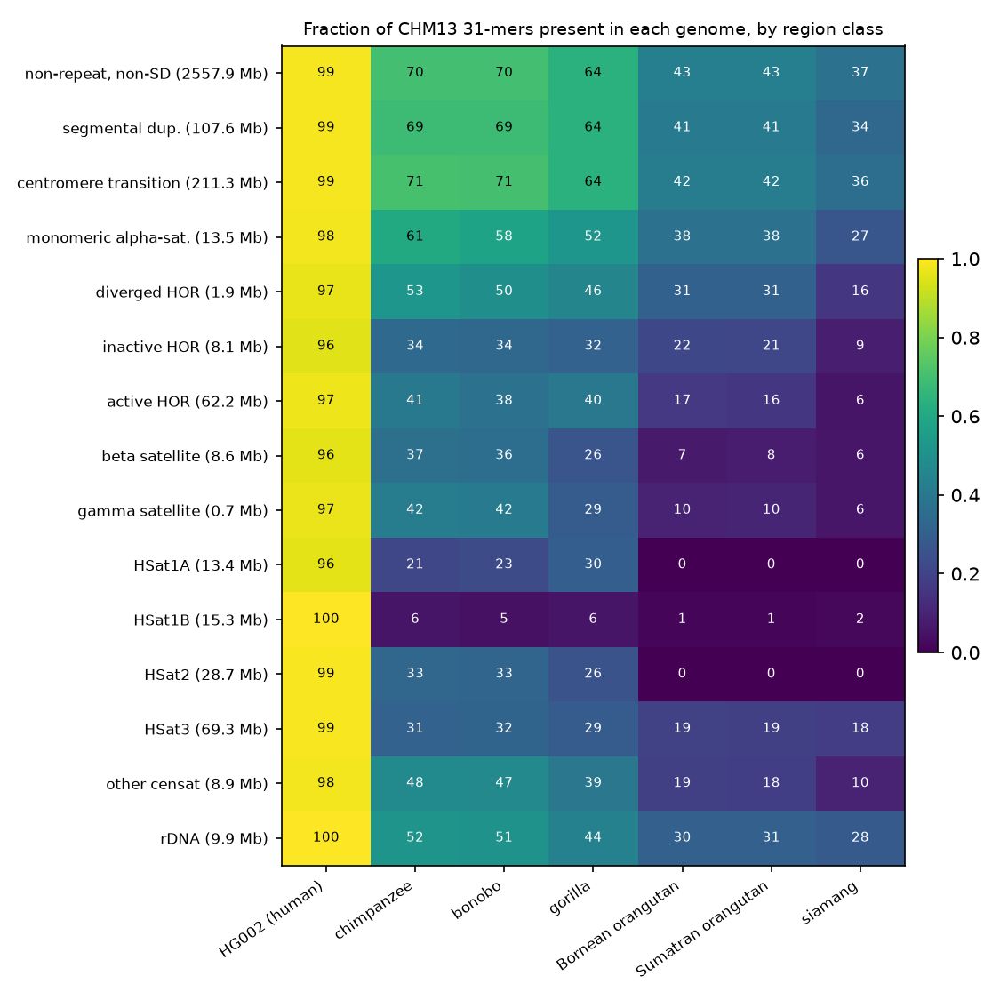
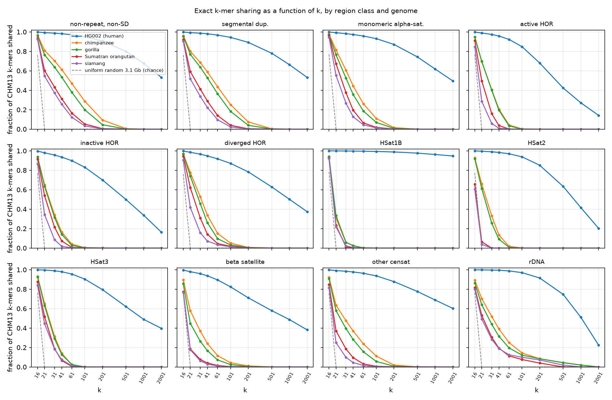
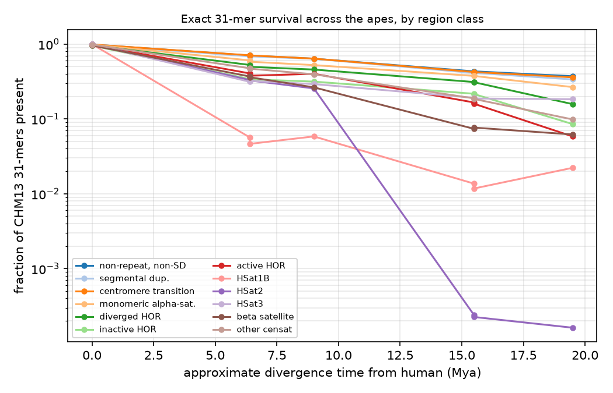
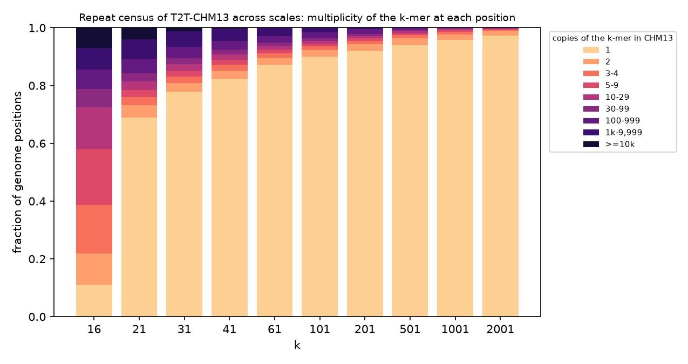
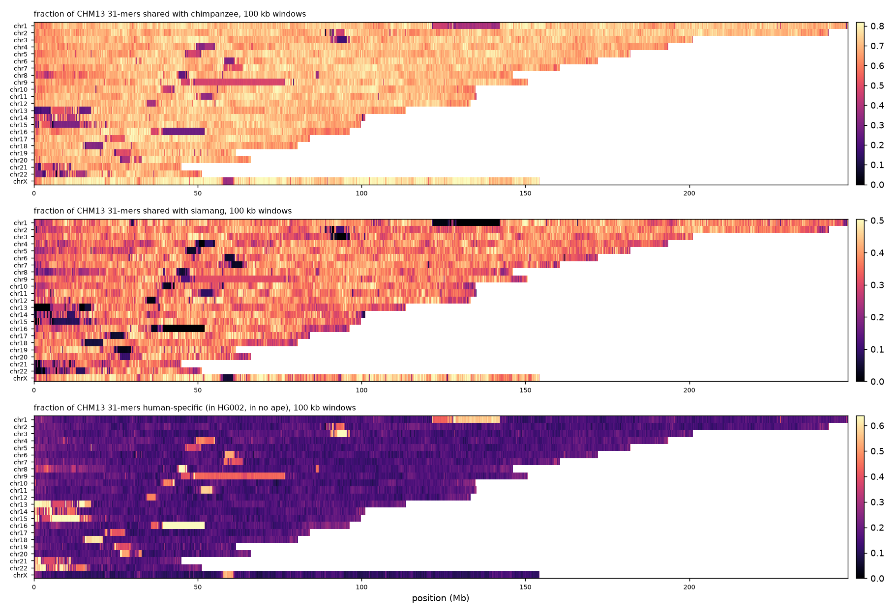

\noindent $^{1}$Anthropic; first author and corresponding author. $^{2}$github.com/jlanej. $^{*}$The work was carried out in an autonomous session on 11-12 September 2026; the software, the tables and this report are at github.com/jlanej/sketchy_kmer (directory this repository).

# Introduction

The human genome has been compared with the genomes of other apes for twenty years, and since 2025 the comparison can be made against complete, telomere-to-telomere assemblies of chimpanzee, bonobo, gorilla, Bornean and Sumatran orangutan and siamang [1]. Nearly all such comparisons rest on alignment: two sequences are lined up, and every base is scored by the substitutions and gaps it took to line them up. Alignment works where the two genomes have one clear correspondence. It does not work in the satellite arrays of the centromeres and the acrocentric short arms, which hold about six percent of the genome [2, 3]: the arrays are made of thousands of near-identical copies, the copies differ in number and order between individuals and species, and no base has a single counterpart. As a result, the conservation tracks in common use (phyloP, phastCons) simply stop at the array boundaries.

A k-mer is a string of k consecutive bases. Whether an exact k-mer exists in another genome is a question that needs no alignment and is defined at every base of a complete assembly, inside the arrays as much as outside them. The length k sets the scale of the question: a short k-mer asks whether the local vocabulary is shared, a long one whether a whole stretch has survived unchanged. Exact k-mer sharing is a standard way to estimate the distance between genomes in bulk (Mash [4] and its successors), and the T2T consortium has used the shortest unique k-mer at each base to describe mappability within one genome [5]. What has not been done is to record, for every base of the human genome and for a range of k, in which of the ape genomes its exact k-mer still exists.

We do that here. For each base of T2T-CHM13v2.0 [2] we record the presence of its k-mer in a second human genome (HG002 v1.1, both haplotypes [6]) and in the six ape assemblies, at k = 31 at base resolution and along a ladder of k from 16 to 2,001. We call the result the k-mer *strata* of the genome: the deepest lineage in which a k-mer is still present dates the sequence, in the same way that the deepest rock layer containing a fossil dates it (Figure 1). We describe the tool, its validation, and what the strata show, with an emphasis on the satellite classes where no other base-level comparison exists.

{width=100%}

# Methods

## Definitions

For position $p$ on the forward strand of CHM13, the k-mer is the sequence $[p, p+k)$. Its *canonical form* is the smaller of the k-mer and its reverse complement, so that strand does not matter. The k-mer is *valid* if it contains no N and does not cross a contig end.

*Presence* in a subject genome means that the canonical k-mer occurs at least once, on either strand, anywhere in that assembly. This is exact identity: a k-mer present in gorilla may sit at the orthologous locus or at any other. *Multiplicity* is the number of times the k-mer occurs in CHM13 itself; a multiplicity of one means single-copy. The *age* of a k-mer is the deepest lineage in which it is present, using the ladder in Figure 1b: human only (present in HG002 but in no ape), Pan (chimpanzee or bonobo, about 6 to 7 million years), gorilla (9), Pongo (either orangutan, 15), siamang (20). Absence in a shallower lineage is ignored when assigning the age; the non-nested patterns are counted separately. *Chance sharing* is the rate at which unrelated sequences share k-mers, which falls as $4^{-k}$; we measured it with a uniform random genome of 3.1 Gb as an extra subject.

## Genomes and region classes

Table 1 lists the assemblies. The apes are the primary (haploid) representations of the diploid assemblies of Yoo et al. [1]. Region classes follow the CHM13 censat v2.1 annotation [3]: centromere transition, monomeric alpha-satellite, diverged higher-order repeats (HOR), inactive HOR, active HOR (the kinetochore-bound arrays), beta and gamma satellite, HSat1A, HSat1B, HSat2, HSat3, other centromeric satellite and rDNA; these were painted over the segmental-duplication annotation of Vollger et al. [7], and everything else is called "non-repeat, non-SD" (it still contains transposable elements and simple repeats, which are not masked).

| genome | assembly | size (Gb) | role |
|:-------------------------|:-----|-----:|:-----|
| human, T2T-CHM13v2.0 | chm13v2.0 | 3.117 | query |
| human, HG002 v1.1 (maternal + paternal) | hg002v1.1 | 6.000 | subject; query for the within-person test |
| chimpanzee | GCA_028858775.2 (mPanTro3 v2.0) | 3.178 | subject |
| bonobo | GCA_029289425.2 (mPanPan1 v2.0) | 3.245 | subject |
| gorilla | GCA_029281585.2 (mGorGor1 v2.0) | 3.546 | subject |
| Bornean orangutan | GCA_028885625.2 (mPonPyg2 v2.0) | 3.221 | subject |
| Sumatran orangutan | GCA_028885655.2 (mPonAbe1 v2.0) | 3.260 | subject |
| siamang | GCA_028878055.2 (mSymSyn1 v2.0) | 3.263 | subject |
| uniform random | generated, seed 1 | 3.100 | chance control (k ladder only) |

Table: **Genomes.** Sizes are total assembled bases.

## The tool

*kstrata* (Rust, about 600 lines) first converts each assembly to a flat array of base codes. A run then scans the query and every subject once per partition of the key space. Keys are the exact 2-bit encodings of canonical k-mers for k up to 32 and a 61-bit polynomial rolling hash of the k-mer and of its reverse complement above that. Within a partition the query's (key, position) pairs are sorted; the run lengths give the multiplicity of every k-mer; each subject's keys of the same partition are sorted, deduplicated and merged against the query to set one presence bit per subject. The number of partitions follows from a memory budget, so a 3.1 Gb query against 6 Gb subjects runs in 9 to 10 GB of memory at any k; each run of this study took 8 to 13 minutes on a 10-core laptop (Table 10). The output is two byte arrays indexed by position: the presence bits and the multiplicity.

## Validation

*Correctness.* On synthetic genomes with planted forward and reverse-complement repeats, an N run, several contigs and a perfect palindrome, every output byte, the distinct-k-mer count and the multiplicity histogram matched brute-force Python sets of canonical k-mers, for k = 16, 21 and 32 (exact keys) and 33, 51 and 201 (hashed keys), with sampling strides of 1, 4 and 8 and one to four partitions.

*Hash collisions.* For k > 32 the 61-bit hash puts about $1.2 \times 10^{18}$ query-subject pairs into a space of $2.3 \times 10^{18}$ values, so about 0.5 false presences are expected per subject per run. The random control measured 0 at k = 101, 2 at k = 501 and 1 at k = 2,001, against millions of true presences at those k. A collision can only add a false presence, never remove a true one, and the base-resolution k = 31 run uses exact keys.

*Agreement with alignment.* We aligned 5 Mb of CHM13 chr20 (20 to 25 Mb) to the chimpanzee assembly with minimap2 (asm20, exact-match CIGAR). Of the 5,000,000 positions, 3,173,630 start a 31-mer that lies entirely inside an identical run of some alignment, and *kstrata* reports every one of them present in chimpanzee (3,173,630 of 3,173,630). Of the 1,816,311 positions whose alignment carries a mismatch or indel inside the window, 13.4% are nonetheless present in chimpanzee, almost all of them multi-copy k-mers; among the single-copy ones, 1.9% are present. Presence over the region is 68.4% by *kstrata* against 63.5% identical by alignment; the difference is what alignment-free presence measures and alignment does not, the same k-mer existing at another place.

## Analyses

The k ladder used every eighth position of CHM13 (a systematic sample of 390 million positions) at k = 16, 21, 41, 61, 101, 201, 501, 1,001 and 2,001, with the random genome as an eighth subject; k = 31 was run at every position. Per-base divergence was estimated from non-repeat sequence in two ways: from k = 31 alone as $d = 1 - f^{1/k}$, where $f$ is the shared fraction, and from the slope of $\ln f$ against k over k = 31 to 201, which cancels any constant factor. Ages were assigned per k-mer from the seven presence bits. For every active HOR array of CHM13 (intervals of the annotation within 500 kb merged), the fraction of 31-mers present in each genome was computed exactly from the base-resolution arrays. Identical segments of at least k bases were counted at k = 501, 1,001 and 2,001 as runs of consecutive sampled positions whose k-mer is present. The within-person comparison used the maternal haplotype of HG002 as query and its paternal haplotype and CHM13 as subjects, on the autosomes (the paternal haplotype carries a Y, not an X).

# Results

## Exact 31-mer sharing by region class

Table 2 and Figure 2 give the fraction of CHM13 positions whose 31-mer exists in each genome. Outside the repeats, 70% of human 31-mers exist in chimpanzee and bonobo, 64% in gorilla, 43% in either orangutan and 37% in siamang, and 98.7% in the second human genome. Segmental duplications and the centromere-transition class behave like the rest of the genome.

| region class | Mb | HG002 | chimp | gorilla | S. orang | siamang | any ape | human only | CHM13 only | single copy |
|:-------------------------|-----:|-----:|-----:|-----:|-----:|-----:|-----:|-----:|-----:|-----:|
| non-repeat, non-SD | 2557.9 | 98.7 | 70.3 | 63.9 | 43.2 | 37.2 | 82.9 | 16.2 | 0.8 | 87.7 |
| segmental duplication | 107.6 | 98.7 | 68.5 | 63.7 | 41.3 | 33.7 | 79.4 | 19.6 | 1.0 | 30.7 |
| centromere transition | 211.3 | 98.8 | 70.8 | 63.9 | 42.4 | 36.0 | 81.8 | 17.3 | 0.8 | 64.1 |
| monomeric alpha-satellite | 13.5 | 98.2 | 60.6 | 52.4 | 37.5 | 26.6 | 71.4 | 27.4 | 1.3 | 42.3 |
| diverged HOR | 1.9 | 96.6 | 52.7 | 45.7 | 30.9 | 15.8 | 61.3 | 35.9 | 2.8 | 44.6 |
| inactive HOR | 8.1 | 95.6 | 34.1 | 31.5 | 21.5 | 8.5 | 44.8 | 51.2 | 3.9 | 4.6 |
| active HOR | 62.2 | 97.4 | 40.6 | 40.1 | 15.9 | 5.8 | 50.5 | 47.1 | 2.3 | 1.1 |
| beta satellite | 8.6 | 95.9 | 36.9 | 26.4 | 7.7 | 6.2 | 41.6 | 54.4 | 4.0 | 23.5 |
| gamma satellite | 0.7 | 96.9 | 42.1 | 29.2 | 10.2 | 6.1 | 52.5 | 44.7 | 2.7 | 74.1 |
| HSat1A | 13.4 | 95.8 | 21.4 | 29.8 | 0.0 | 0.0 | 33.8 | 62.2 | 3.9 | 1.9 |
| HSat1B | 15.3 | 99.8 | 5.7 | 5.8 | 1.2 | 2.2 | 7.3 | 92.5 | 0.2 | 1.4 |
| HSat2 | 28.7 | 99.0 | 33.1 | 25.6 | 0.0 | 0.0 | 37.6 | 61.4 | 1.0 | 2.9 |
| HSat3 | 69.3 | 98.9 | 31.4 | 29.2 | 18.8 | 18.3 | 39.2 | 59.8 | 1.0 | 4.9 |
| other censat | 8.9 | 98.4 | 47.5 | 39.5 | 18.5 | 9.8 | 58.4 | 40.3 | 1.3 | 21.0 |
| rDNA | 9.9 | 99.6 | 52.0 | 43.9 | 30.5 | 28.4 | 61.5 | 38.2 | 0.3 | 0.1 |
| **whole genome** | 3117.3 | 98.7 | 67.6 | 61.4 | 40.9 | 34.9 | 79.7 | 19.4 | 0.9 | 77.9 |

Table: **Percentage of CHM13 31-mers present in each genome, by region class.** Bonobo and Bornean orangutan track chimpanzee and Sumatran orangutan within one point and are omitted. "Human only": present in HG002 and in no ape. "CHM13 only": present in no other genome. "Single copy": the 31-mer occurs once in CHM13.

{width=78%}

The satellite classes divide into three kinds. Alpha-satellite is shared to a depth that follows its known age structure: monomeric arrays keep 61% of their 31-mers in chimpanzee and 27% in siamang; diverged HORs 53% and 16%; inactive HORs 34% and 9%; the active, kinetochore-bound arrays 41% in chimpanzee, 40% in gorilla, 16% in orangutans and 6% in siamang. HSat3 and the rDNA keep a floor of 18 to 28% to siamang. HSat2 and HSat1A, by contrast, are shared only with the African apes (33% and 21 to 30% of 31-mers) and have essentially no exact 31-mer in either orangutan or siamang (HSat2: 0.01%). HSat1B is almost entirely human-specific: 92.5% of its 31-mers are in no ape, 5.7% in chimpanzee, while 99.8% are in HG002. Beta and gamma satellite sit in between.

Two columns describe the human side. The CHM13-only fraction, k-mers in no other genome including HG002, is 0.8% outside repeats and 3 to 4% in the HOR arrays, HSat1A and beta satellite; it bounds the sum of CHM13-private variation and assembly error at k = 31. The single-copy column is 88% outside repeats, 31% in segmental duplications and 1 to 5% in the active HORs and the HSat classes, which is why those classes cannot be resolved by k-mers of this length.

## Age strata

Dating every 31-mer by its deepest carrier (Table 3), 35% of the genome predates the split from gibbons, a further 16% is shared out to orangutans, 20% to gorilla and 9% to chimpanzee and bonobo only; 19% is human-specific and 0.9% is private to CHM13. The human-specific fraction is 16% in non-repeat sequence and 47 to 92% in the active HOR arrays, HSat1A, HSat1B and HSat2: sequence that arose, or was homogenized to its present state, after the human lineage separated.

| region class | Mb | CHM13 only | human only | to Pan | to gorilla | to orangutan | to siamang | gorilla not Pan | chimp not bonobo | bonobo not chimp |
|:-------------------------|-----:|-----:|-----:|-----:|-----:|-----:|-----:|-----:|-----:|-----:|
| non-repeat, non-SD | 2557.9 | 0.8 | 16.2 | 9.1 | 19.6 | 17.1 | 37.2 | 3.1 | 3.6 | 3.6 |
| segmental duplication | 107.6 | 1.0 | 19.6 | 8.9 | 21.1 | 15.6 | 33.7 | 3.6 | 2.9 | 3.0 |
| centromere transition | 211.3 | 0.8 | 17.3 | 9.7 | 20.1 | 16.0 | 36.0 | 3.1 | 3.4 | 3.2 |
| monomeric alpha-satellite | 13.5 | 1.3 | 27.4 | 13.2 | 17.3 | 14.2 | 26.6 | 4.3 | 5.4 | 3.1 |
| diverged HOR | 1.9 | 2.8 | 35.9 | 11.5 | 16.7 | 17.3 | 15.8 | 3.6 | 5.4 | 2.5 |
| inactive HOR | 8.1 | 3.9 | 51.2 | 8.5 | 12.8 | 15.1 | 8.5 | 3.9 | 3.6 | 3.3 |
| active HOR | 62.2 | 2.3 | 47.1 | 8.1 | 24.4 | 12.2 | 5.8 | 5.6 | 5.4 | 2.6 |
| beta satellite | 8.6 | 4.0 | 54.4 | 12.9 | 18.3 | 4.1 | 6.2 | 1.7 | 2.6 | 1.8 |
| gamma satellite | 0.7 | 2.7 | 44.7 | 19.0 | 20.4 | 7.1 | 6.1 | 4.6 | 4.5 | 4.0 |
| HSat1A | 13.4 | 3.9 | 62.2 | 4.0 | 29.8 | 0.0 | 0.0 | 8.2 | 3.0 | 4.3 |
| HSat1B | 15.3 | 0.2 | 92.5 | 1.0 | 3.5 | 0.6 | 2.2 | 1.0 | 1.1 | 0.1 |
| HSat2 | 28.7 | 1.0 | 61.4 | 12.0 | 25.5 | 0.0 | 0.0 | 2.0 | 2.9 | 2.5 |
| HSat3 | 69.3 | 1.0 | 59.8 | 7.4 | 10.1 | 3.3 | 18.3 | 2.3 | 3.0 | 3.8 |
| other censat | 8.9 | 1.3 | 40.3 | 14.3 | 22.6 | 11.7 | 9.8 | 4.8 | 3.1 | 2.6 |
| rDNA | 9.9 | 0.3 | 38.2 | 12.1 | 13.7 | 7.4 | 28.4 | 3.5 | 3.0 | 2.4 |
| **whole genome** | 3117.3 | 0.9 | 19.4 | 9.1 | 19.5 | 16.2 | 34.9 | 3.2 | 3.6 | 3.5 |

Table: **Age strata of CHM13 31-mers (percent of positions).** Each k-mer is placed in the stratum of its deepest carrier. The last three columns count non-nested patterns: present in gorilla but in neither chimpanzee nor bonobo (and in no more distant ape), and the chimpanzee/bonobo asymmetry.

The non-nested patterns have the size expected from the branch lengths. In non-repeat sequence, k-mers present in a Pan genome but not in gorilla (9.1%) outnumber those present in gorilla but in neither Pan genome (3.1%) by 2.9 to 1. A k-mer of the first kind can be lost anywhere on the gorilla lineage or gained on the human-Pan stem, about 12 million years of branch; one of the second kind must be lost on the Pan stem before the chimpanzee-bonobo split, about 4 to 5 million years, with incomplete lineage sorting adding to it. Chimpanzee-not-bonobo and bonobo-not-chimpanzee are equal (3.6% each), as they should be for two branches of the same length; among 31-mers present in chimpanzee, 5.1% are absent from bonobo, a per-base rate of about 0.17% on the bonobo branch, in line with the total divergence of about 0.4% between the two species. HSat1A is the one class in which gorilla is the closest ape (30% against 21 to 23%), with a gorilla-not-Pan excess of 8.2% against 4.0%.

## The scale of conservation

Figure 3 and Table 4 give sharing as a function of k. The random control fixes the scale at which sharing means descent: a uniform random 3.1 Gb genome contains 76% of all 16-mers (the expected $1 - e^{-3.1/2.15}$), 0.1 to 0.3% of 21-mers and none of any longer k-mer. So k = 16 is dominated by chance in every class, and everything from k = 21 upward is identity by descent, or by convergent homogenization in satellites.

{width=100%}

| class, genome | k=16 | 21 | 31 | 41 | 61 | 101 | 201 | 501 | 1001 | 2001 |
|:-------------------------|-----:|-----:|-----:|-----:|-----:|-----:|-----:|-----:|-----:|-----:|
| non-repeat, chimpanzee | 96.8 | 80.9 | 70.3 | 61.3 | 46.9 | 28.6 | 9.4 | 0.5 | 0.02 | 0.00 |
| non-repeat, siamang | 92.5 | 54.6 | 37.2 | 25.6 | 12.2 | 3.3 | 0.3 | 0.00 | 0.00 | 0.00 |
| non-repeat, random | 76.2 | 0.1 | 0 | 0 | 0 | 0 | 0 | 0 | 0 | 0 |
| segmental dup., chimpanzee | 96.1 | 80.1 | 68.5 | 58.8 | 43.6 | 25.2 | 7.4 | 0.3 | 0.01 | 0.00 |
| monomeric alpha, chimpanzee | 97.8 | 81.5 | 60.6 | 44.5 | 26.1 | 10.9 | 1.5 | 0.02 | 0 | 0 |
| active HOR, chimpanzee | 94.6 | 69.6 | 40.6 | 20.6 | 4.2 | 0.2 | 0.01 | 0 | 0 | 0 |
| active HOR, siamang | 84.9 | 28.7 | 5.8 | 0.9 | 0.02 | 0 | 0 | 0 | 0 | 0 |
| inactive HOR, chimpanzee | 93.9 | 64.9 | 34.1 | 16.4 | 4.0 | 0.4 | 0.01 | 0 | 0 | 0 |
| HSat3, chimpanzee | 93.3 | 65.1 | 31.4 | 14.1 | 2.0 | 0.03 | 0 | 0 | 0 | 0 |
| HSat3, siamang | 84.0 | 44.7 | 18.3 | 7.5 | 1.1 | 0.02 | 0 | 0 | 0 | 0 |
| HSat2, chimpanzee | 92.8 | 65.9 | 33.1 | 13.4 | 1.7 | 0.1 | 0 | 0 | 0 | 0 |
| HSat1B, chimpanzee | 93.6 | 30.8 | 5.7 | 2.5 | 0.1 | 0 | 0 | 0 | 0 | 0 |
| beta satellite, chimpanzee | 89.6 | 57.9 | 36.9 | 24.0 | 11.6 | 4.3 | 1.0 | 0.03 | 0 | 0 |
| rDNA, chimpanzee | 89.3 | 70.3 | 52.0 | 39.1 | 25.0 | 14.3 | 8.0 | 4.0 | 1.7 | 0.3 |
| rDNA, siamang | 79.8 | 49.4 | 28.4 | 18.8 | 12.5 | 9.9 | 6.5 | 2.9 | 1.0 | 0.02 |

Table: **Percentage of CHM13 k-mers present, along the k ladder.** Values below 0.005% are shown as 0.

Outside the repeats the curves are geometric in k with a slope set by divergence (next section). The satellite classes fall faster, and differently. The active HOR arrays keep 41% of their 31-mers in chimpanzee but 4% of 61-mers and 0.2% of 101-mers, an effective per-base difference of about 7% between a human HOR copy and its nearest chimpanzee copy; against orangutan the array k-mers are gone by k = 61 and against siamang by k = 41, while the same class shares 85 to 95% of its 16-mers with every ape. The monomer vocabulary is old; the higher-order arrangement is not. HSat2 loses its chimpanzee 31-mers by k = 101 and has no orangutan or siamang k-mer beyond k = 21; HSat1B has none beyond k = 41 in any ape. HSat3 is the exception that reveals the mechanism: its 31-mers are shared with siamang (18%) to the same degree that the active HORs are shared with chimpanzee, and its chimpanzee and siamang curves have the same slope, because what is shared is the near-perfect (GGAAT)$_n$ runs that every ape carries, not descent from a common array. Beta satellite and the rDNA retain a conserved core: 4% and 14% of 101-mers in chimpanzee, 10% of rDNA 101-mers in siamang.

## Divergence from k-mer survival

In sequence without repeats, an exact k-mer survives between two genomes when none of its k bases has changed on either lineage, so the shared fraction is close to $(1-d)^k$ for a per-base divergence $d$. Table 5 gives two alignment-free estimates against the published alignment-based values, and Figure 4 shows survival against divergence time for every class.

| genome | 31-mers shared, non-repeat (%) | d from k = 31 alone (%) | d from the slope over k = 31 to 201 (%) | published divergence (%) |
|:-------------------------|-----:|-----:|-----:|:-----|
| HG002 | 98.73 | 0.041 | 0.050 | about 0.1 (heterozygosity) |
| chimpanzee | 70.31 | 1.130 | 1.172 | 1.23 [8] |
| bonobo | 70.27 | 1.132 | 1.174 | about 1.3 [9] |
| gorilla | 63.86 | 1.436 | 1.538 | 1.75 [10] |
| Bornean orangutan | 43.22 | 2.670 | 2.575 | 3.1 [11] |
| Sumatran orangutan | 43.25 | 2.668 | 2.572 | 3.1 [11] |
| siamang | 37.20 | 3.140 | 2.877 | not tabulated |

Table: **Apparent per-base divergence from k-mer survival in non-repeat sequence.** The slope estimate cancels any constant factor in the shared fraction.

The slope recovers the published divergences without an alignment: 1.17% for chimpanzee and bonobo, 1.54% for gorilla, 2.57% for the orangutans, against 1.23, 1.75 and 3.1%. The estimates are lower than the alignment values, and lower still when the fit extends to longer k (chimpanzee: 1.28% over k = 31 to 101, 1.17% over 31 to 201), for a reason built into k-mer survival: the shared fraction is an average of $(1-d_{\rm local})^k$ over regions whose local divergence varies, and long k-mers survive preferentially in the least diverged regions, so the effective rate is pulled towards the conserved end of the distribution (Mash distances carry the same bias). The single-point estimate from k = 31 alone is lower again because at k = 31 a k-mer lost at the orthologous locus is sometimes found elsewhere. The column should therefore be read as an alignment-free lower bound on mean divergence that ranks the genomes correctly and lands within 0.1 to 0.5 points of the published values.

{width=72%}

## Within one person

The same measurement can be made inside a diploid genome (Table 6). On the autosomes, 97.4% of the maternal haplotype's 31-mers exist in the paternal haplotype and 97.5% in CHM13, the same number to a tenth of a percent: at k = 31 the two haplotypes of one person are as far apart as either is from a third person, as expected for two independent draws from the population, and the 2.5% loss corresponds to a per-base difference of about 0.08%. The order flips inside the centromeres: active HOR 31-mers of the maternal haplotype are found in the paternal haplotype 97.5% of the time but in CHM13 95.5%, and HSat1B 86.9% against 95.2%, so a centromere haplotype can be closer to CHM13's than to the other haplotype in the same nucleus. Only 1.1% of active-HOR 31-mers and 2 to 7% of HSat 31-mers are single-copy within one haplotype, against 86% outside the repeats.

| region class (HG002 maternal autosomes) | Mb | in paternal (%) | in CHM13 (%) | in either (%) | single copy (%) |
|:-------------------------|-----:|-----:|-----:|-----:|-----:|
| non-repeat, non-SD | 2627.3 | 97.5 | 97.5 | 98.7 | 85.7 |
| centromere transition | 79.7 | 97.0 | 97.9 | 98.8 | 34.7 |
| monomeric alpha-satellite | 12.9 | 97.3 | 96.7 | 98.4 | 40.3 |
| diverged HOR | 1.7 | 97.2 | 94.7 | 98.6 | 47.1 |
| inactive HOR | 7.9 | 93.5 | 93.4 | 96.4 | 5.1 |
| active HOR | 58.4 | 97.5 | 95.5 | 98.6 | 1.1 |
| beta satellite | 5.8 | 95.7 | 96.3 | 97.7 | 22.7 |
| gamma satellite | 0.7 | 96.2 | 95.0 | 98.0 | 64.8 |
| HSat1A | 11.3 | 91.3 | 95.3 | 96.9 | 2.2 |
| HSat1B | 1.4 | 86.9 | 95.2 | 97.0 | 5.7 |
| HSat2 | 18.0 | 96.7 | 98.1 | 98.9 | 4.5 |
| HSat3 | 40.9 | 94.9 | 96.7 | 97.7 | 6.8 |
| other censat | 6.7 | 95.2 | 95.5 | 97.1 | 26.3 |
| rDNA | 1.1 | 98.8 | 98.5 | 99.1 | 2.9 |
| **all autosomes** | 2873.8 | 97.4 | 97.5 | 98.7 | 79.8 |

Table: **31-mers of the HG002 maternal haplotype found in the paternal haplotype and in CHM13.** Classes follow the HG002 cenSat v2.0 annotation.

## Repeat census across scales

The same runs give the copy-number spectrum of the assembled genome as a function of scale (Figure 5, Table 7). At k = 16 only 11% of positions carry a single-copy k-mer, because $4^{16}$ is about the genome size and most 16-mers recur by chance. At k = 21 the chance component is gone and 69% of positions are single-copy; k = 31 brings 78% and k = 101 90%. Beyond that the gain is slow, 94% at k = 501 and 97% at 2,001, and the remaining 3% of the genome, the positions whose 2 kb context still occurs at least twice, are the satellite arrays, the rDNA and the youngest segmental duplications. The high-copy bins collapse first: k-mers present a thousand times or more fall from 6.6% of positions at k = 31 to nil at k = 501, while the two-copy bin is the most persistent, still 1.7% at k = 2,001.

{width=80%}

| k | distinct k-mers ($10^9$) | single copy | 2 | 3-9 | 10-99 | 100-999 | $\geq$ 1000 |
|-------------------------:|-----:|-----:|-----:|-----:|-----:|-----:|-----:|
| 16 | 0.800 | 11.1 | 10.7 | 36.3 | 20.7 | 6.9 | 14.4 |
| 21 | 2.261 | 68.9 | 4.3 | 5.3 | 5.8 | 5.0 | 10.7 |
| 31 | 2.512 | 77.9 | 3.1 | 4.3 | 4.4 | 3.7 | 6.6 |
| 41 | 2.645 | 82.4 | 2.8 | 3.7 | 3.5 | 2.9 | 4.6 |
| 61 | 2.780 | 87.1 | 2.4 | 2.9 | 2.4 | 2.3 | 2.9 |
| 101 | 2.861 | 90.1 | 2.1 | 2.4 | 1.8 | 2.1 | 1.6 |
| 201 | 2.923 | 92.1 | 2.1 | 2.1 | 1.6 | 1.6 | 0.5 |
| 501 | 2.985 | 94.2 | 2.2 | 1.8 | 1.2 | 0.6 | 0.0 |
| 1001 | 3.027 | 95.7 | 2.0 | 1.4 | 0.7 | 0.1 | 0.0 |
| 2001 | 3.063 | 97.2 | 1.7 | 0.7 | 0.4 | 0.0 | 0.0 |

Table: **Percentage of CHM13 positions by the multiplicity of their k-mer in CHM13.**

## Stratigraphy of the centromeres

Figure 6 shows the strata across five centromeres at 10 kb resolution, and Table 8 gives every active HOR array exactly. Two features are invisible in any class average. First, each active array has a flat sharing level per ape across its whole length (chr1: 45% chimpanzee, 44% gorilla, 7% orangutan, 2% siamang over 4.5 Mb, with fluctuations of a few points), stepping to other levels at the array boundaries. The age of an active array is a property of the array, as homogenization predicts, not of a position within it. Second, the layers outside the active array (monomeric and diverged alpha-satellite, the HSat blocks) are spikier and mostly more shared, including with orangutan and siamang: on chr8 the monomeric layer at 43.6 to 44.2 Mb keeps 60 to 80% of its 31-mers in the apes while the active array beside it keeps 23 to 27%; on chr17 the older layers at 21.8 to 23.3 Mb sit at 40 to 80% while the 3.6 Mb active array holds 53% in chimpanzee, 32% in gorilla, 18% in orangutan and 5% in siamang. This is the layered-expansion picture of alpha-satellite evolution [3, 12] seen through exact k-mers: the youngest, most homogenized layer is the least shared.

{width=100%}

| active HOR array | Mb | single copy | HG002 | chimp | bonobo | gorilla | B. orang | S. orang | siamang |
|:-------------------------|-----:|-----:|-----:|-----:|-----:|-----:|-----:|-----:|-----:|
| chr1:121.80-126.30 | 4.50 | 0.9 | 97.4 | 45.6 | 41.4 | 44.0 | 8.1 | 6.9 | 1.6 |
| chr2:92.32-94.67 | 2.36 | 1.7 | 96.7 | 45.6 | 43.4 | 43.1 | 24.2 | 23.7 | 10.4 |
| chr3:91.74-92.90 | 0.89 | 1.1 | 99.6 | 41.6 | 35.6 | 40.7 | 12.7 | 11.3 | 3.7 |
| chr3:95.86-96.42 | 0.55 | 2.1 | 97.1 | 41.1 | 36.0 | 40.3 | 13.0 | 11.7 | 3.6 |
| chr4:49.71-50.43 | 0.73 | 0.9 | 95.4 | 38.6 | 35.6 | 45.4 | 24.0 | 23.2 | 9.3 |
| chr4:52.12-55.20 | 2.97 | 0.9 | 94.3 | 38.7 | 35.6 | 45.9 | 24.1 | 23.3 | 9.6 |
| chr5:47.04-49.60 | 2.53 | 0.8 | 96.2 | 47.7 | 41.4 | 48.7 | 11.5 | 11.3 | 3.8 |
| chr6:58.29-61.06 | 2.77 | 0.4 | 89.5 | 29.2 | 25.6 | 22.8 | 14.9 | 15.3 | 4.5 |
| chr7:60.41-63.71 | 3.30 | 0.8 | 99.8 | 50.5 | 40.7 | 49.5 | 14.4 | 14.2 | 3.4 |
| chr8:44.22-46.33 | 2.08 | 1.2 | 95.8 | 23.2 | 23.2 | 26.5 | 9.3 | 8.7 | 4.7 |
| chr9:44.95-47.58 | 2.63 | 1.6 | 99.0 | 47.0 | 47.0 | 52.2 | 31.3 | 29.4 | 12.7 |
| chr10:39.63-41.66 | 2.03 | 1.6 | 95.9 | 44.0 | 40.9 | 44.4 | 11.2 | 10.8 | 2.9 |
| chr11:51.04-54.41 | 3.38 | 1.0 | 94.3 | 33.2 | 29.9 | 24.1 | 18.0 | 17.2 | 8.7 |
| chr12:34.62-37.20 | 2.58 | 1.6 | 94.2 | 37.6 | 33.8 | 41.9 | 12.4 | 12.7 | 1.8 |
| chr13:15.55-17.50 | 1.95 | 0.3 | 99.7 | 27.2 | 27.0 | 44.2 | 14.4 | 13.2 | 5.4 |
| chr14:10.09-12.71 | 2.62 | 0.4 | 98.1 | 39.4 | 39.0 | 45.2 | 22.0 | 21.2 | 8.7 |
| chr15:16.68-17.69 | 1.02 | 1.1 | 99.2 | 46.9 | 45.5 | 52.1 | 24.5 | 24.7 | 10.0 |
| chr16:35.85-37.83 | 1.98 | 1.1 | 99.7 | 48.2 | 44.6 | 46.7 | 8.8 | 7.8 | 2.8 |
| chr17:23.89-27.49 | 3.59 | 1.2 | 99.5 | 53.4 | 48.3 | 32.4 | 17.6 | 17.5 | 4.7 |
| chr18:15.97-20.93 | 4.97 | 0.9 | 99.7 | 31.4 | 31.5 | 32.1 | 19.2 | 17.5 | 5.9 |
| chr19:25.82-29.77 | 3.95 | 1.5 | 98.6 | 48.9 | 44.5 | 49.5 | 9.0 | 7.8 | 2.5 |
| chr20:26.93-29.10 | 2.17 | 1.1 | 99.3 | 39.0 | 39.4 | 40.5 | 22.6 | 22.6 | 9.5 |
| chr21:10.96-11.31 | 0.34 | 1.1 | 99.5 | 25.2 | 24.9 | 41.3 | 12.3 | 11.5 | 5.0 |
| chr22:12.79-15.71 | 2.92 | 1.1 | 98.0 | 38.4 | 37.6 | 44.2 | 21.7 | 21.0 | 8.0 |
| chrX:57.82-60.93 | 3.11 | 1.6 | 99.2 | 36.3 | 36.5 | 26.3 | 15.0 | 15.5 | 5.2 |

Table: **Every active HOR array of CHM13: percentage of its 31-mers that are single-copy in CHM13 and present in each genome.** Intervals of the annotation within 500 kb are merged.

Across the 25 arrays the ape with the highest sharing is gorilla for 15 and chimpanzee for 9 (chr13: 44% gorilla against 27% chimpanzee; chr21: 41% against 25%). This should not be read as phylogeny. Presence is presence anywhere in the subject, and the gorilla assembly is the largest, with the largest alpha-satellite repertoire, so it contains more of any human HOR k-mer set; a symmetric measure (the fraction of the gorilla array's k-mers present in CHM13, or a Jaccard index over the two arrays) would be needed to compare closeness. Within one subject, however, the arrays differ two-fold in how much of them that subject carries (chimpanzee: 23% on chr8 to 53% on chr17), and the HG002 column ranks the arrays by their polymorphism in humans (89.5% of chr6's active-array 31-mers are in HG002 against 99.8% of chr7's).

## Genome-wide view and long identical segments

Figure 7 shows the strata along every chromosome at 100 kb resolution. The human-specific fraction picks out the centromeres, the acrocentric short arms (chromosomes 13, 14, 15, 21 and 22), the HSat3 block of chromosome 9 and the HSat2 blocks of chromosomes 1 and 16; sharing with siamang falls to zero in the same places.

{width=100%}

At long k the strata become discrete objects (Table 9): stretches of DNA that are still letter-for-letter identical between species. There are 125,475 stretches of at least 501 identical bases with chimpanzee, 32,673 with gorilla, about 2,100 with each orangutan and 2,278 with siamang (1,104 of them in the rDNA). At 1,001 bases: 2,186 with chimpanzee (1,794 outside repeats, 222 in the rDNA), 568 with gorilla, 56 to 58 with the orangutans and 48 with siamang. Reading the 48 siamang segments from the sequence sorts them into two kinds: 28 are telomeric (TTAGGG)$_n$ tracts within a few kilobases of a chromosome end, perfect repeats that are identical in every ape, and 20 are stretches of single-copy sequence of 1.0 to 1.5 kb, ultraconserved elements found by another route (several at classic loci, such as the PAX6 region of chromosome 11 and a site near BCL11A on chromosome 2). At 2,001 bases the count is 13 with chimpanzee and 4 with siamang, all four telomeric, while HG002 still shares 323,668 such segments with CHM13: 2 kb of exact identity is common within a species and, outside the telomeres, absent between species.

| k | HG002 | chimpanzee | bonobo | gorilla | B. orangutan | S. orangutan | siamang | random |
|-------------------------:|-----:|-----:|-----:|-----:|-----:|-----:|-----:|-----:|
| 501 | 966,257 | 125,475 | 124,367 | 32,673 | 2,087 | 2,108 | 2,278 | 2 |
| 1001 | 613,405 | 2,186 | 2,163 | 568 | 56 | 58 | 48 | 0 |
| 2001 | 323,668 | 13 | 11 | 5 | 6 | 6 | 4 | 1 |

Table: **Number of exactly identical segments of at least k bases between CHM13 and each genome**, counted as runs of sampled positions (every eighth) whose k-mer is present. Telomeric (TTAGGG)$_n$ tracts and the rDNA contribute to every column; the random column shows the hash-collision background of the hashed runs.

| run | k | positions | partitions | wall time (s) | peak memory (GB) |
|:-------------------------|-----:|:-----|-----:|-----:|-----:|
| k = 31, all subjects | 31 | every position | 16 | 730 | 8.8 |
| k ladder (each of 9 runs) | 16 to 2001 | every 8th | 2 | 505 to 766 | 9.9 to 10.4 |
| within-person (maternal query) | 31 | every position | 16 | 254 | 7.3 |

Table: **Compute.** Apple M1 Max, 10 cores, 64 GB; peak memory is the anonymous footprint reported by `time -l`; each run scans all seven or eight subjects.

# Discussion

The strata answer a simple question at every base of a complete genome, and the answer turns out to be informative in three ways.

First, they provide a conservation measure that exists inside satellites. Alignment-based scores are undefined there; the strata show that the alpha-satellite monomer vocabulary is shared across all apes while the higher-order arrangement of the active arrays is not, that HSat1B is essentially a human invention at the level of 31-mers, that HSat2 and HSat1A stop at the African apes, and that HSat3 and the rDNA carry a conserved core to the gibbons. These statements come from the Yoo et al. assemblies directly, with no model of the arrays.

Second, the strata are quantitative in a way that can be checked. In non-repeat sequence they reproduce the known divergences of the apes from the slope of sharing against k, and inside a person they give the expected heterozygosity, so the same numbers in the satellite classes can be read as effective per-base turnover rates: about 7% between a human HOR copy and its nearest chimpanzee copy, larger for HSat1B and HSat2. Within a single centromere the sharing level is flat across the active array and steps at its edges, which is what homogenization by unequal exchange and gene conversion should produce, and the older flanking layers are more shared, as the layered-expansion model predicts.

Third, the strata are a resource. The base-resolution arrays give any locus a k-mer age; the human-specific and CHM13-only fractions are tracks that can be intersected with any annotation; the census says how much of each region class is single-copy at any k, which is the number that decides whether a k-mer method will work there; and the identical segments of 1 kb and more, once the telomeric repeat tracts are set aside, are a short list of the most conserved sequence between human and gibbon. The tool is generic. It takes any query genome and up to eight subjects at any k, in about ten gigabytes of memory, and the same analysis could be run on the T2T assemblies of several plant accessions or on a bacterial pangenome in minutes.

# Limitations

Presence is not orthology: a k-mer present in gorilla may be at a paralogous locus or in a satellite copy elsewhere, and the age strata date the sequence, not the locus. Absence has several causes: mutation on either lineage, deletion, an unassembled or collapsed region of the subject (several ape centromeres and rDNA arrays are incompletely resolved in the v2.0 assemblies), and residual assembly error, so inside satellites the ape-absence rates are upper bounds on turnover. The ape assemblies are haploid representations of diploid genomes, so k-mers on the other haplotype are invisible, which lowers presence by the ape's heterozygosity at k = 31 (of order 1 to 3% outside repeats). CHM13 is one haplotype of one genome; the HG002 comparison shows how much of the k-mer content is private to a person, but the ape strata were computed on CHM13 alone. Exact matching is sensitive to divergence in proportion to k and says nothing about similarity below identity; that is the purpose of the ladder. Finally, the region classes are CHM13's own annotation, and the non-repeat class still contains transposable elements.

# Data and code availability

The tool (`kstrata`, Rust, MIT licence), every script, the brute-force and alignment validations, the per-class, per-array, age and segment tables, the multiplicity histograms of every run, the figures and the 100 kb genome-wide track are in the this repository directory of github.com/jlanej/sketchy_kmer. The base-resolution presence and multiplicity arrays (3.1 GB each) and the 10 kb tracks are regenerated from public assemblies by the commands listed there (about 2.5 hours on a 10-core laptop, including downloads).

# Author contributions

C.F. chose the question after a survey of prior work, designed and wrote the tool, ran every experiment, made the figures and wrote the report. J.L. set the brief, provided the machine and reviewed the results.

# References

1. Yoo D. et al. Complete sequencing of ape genomes. *Nature* (2025).
2. Nurk S. et al. The complete sequence of a human genome. *Science* 376, 44-53 (2022).
3. Altemose N. et al. Complete genomic and epigenetic maps of human centromeres. *Science* 376, eabl4178 (2022).
4. Ondov B. D. et al. Mash: fast genome and metagenome distance estimation using MinHash. *Genome Biology* 17, 132 (2016).
5. Telomere-to-Telomere consortium. CHM13 mappability tracks (minimum unique k-mer length). https://s3-us-west-2.amazonaws.com/human-pangenomics/T2T/browser/CHM13/html/mappability.html
6. Telomere-to-Telomere consortium. HG002 v1.1 diploid assembly and cenSat v2.0 annotation (2024). s3://human-pangenomics/T2T/HG002/assemblies
7. Vollger M. R. et al. Segmental duplications and their variation in a complete human genome. *Science* 376, eabj6965 (2022).
8. The Chimpanzee Sequencing and Analysis Consortium. Initial sequence of the chimpanzee genome and comparison with the human genome. *Nature* 437, 69-87 (2005).
9. Prüfer K. et al. The bonobo genome compared with the chimpanzee and human genomes. *Nature* 486, 527-531 (2012).
10. Scally A. et al. Insights into hominid evolution from the gorilla genome sequence. *Nature* 483, 169-175 (2012).
11. Locke D. P. et al. Comparative and demographic analysis of orang-utan genomes. *Nature* 469, 529-533 (2011).
12. Shepelev V. A. et al. The evolutionary origin of man can be traced in the layers of defunct ancestral alpha satellites flanking the active centromeres of human chromosomes. *PLoS Genetics* 5, e1000641 (2009).
13. Marçais G. & Kingsford C. A fast, lock-free approach for efficient parallel counting of occurrences of k-mers. *Bioinformatics* 27, 764-770 (2011).
